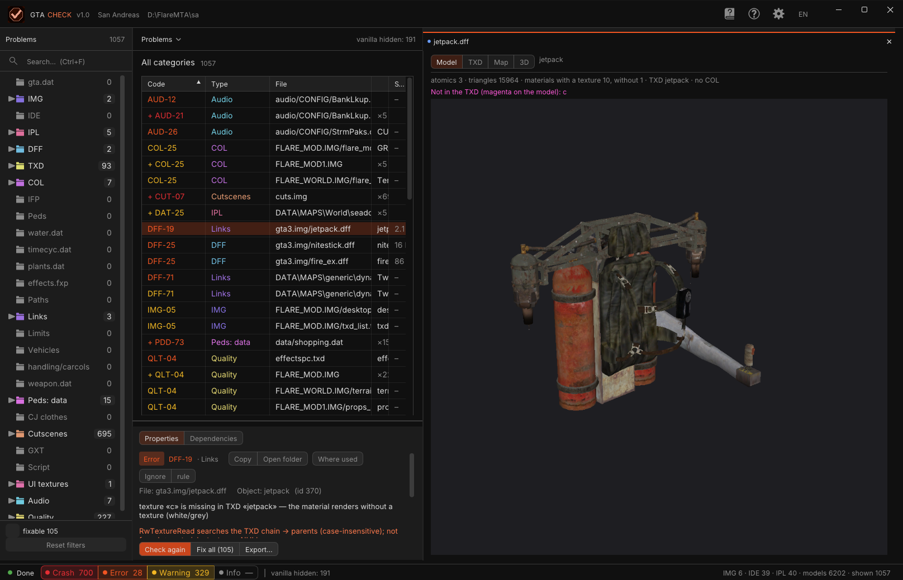
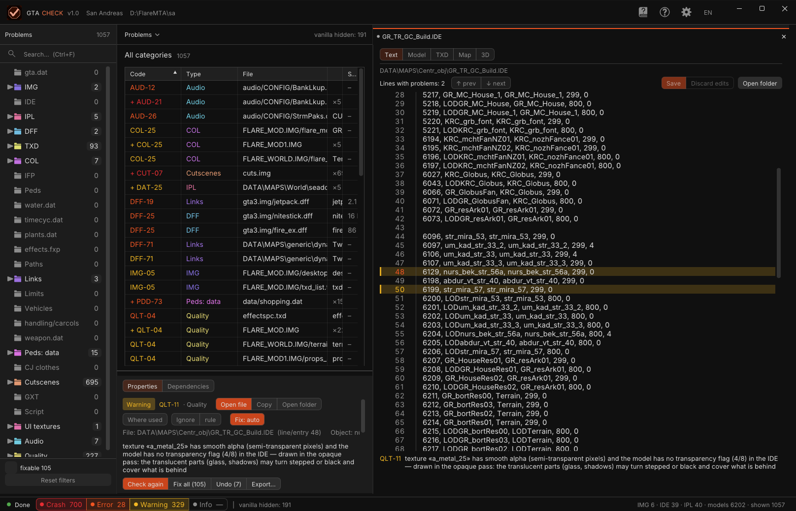
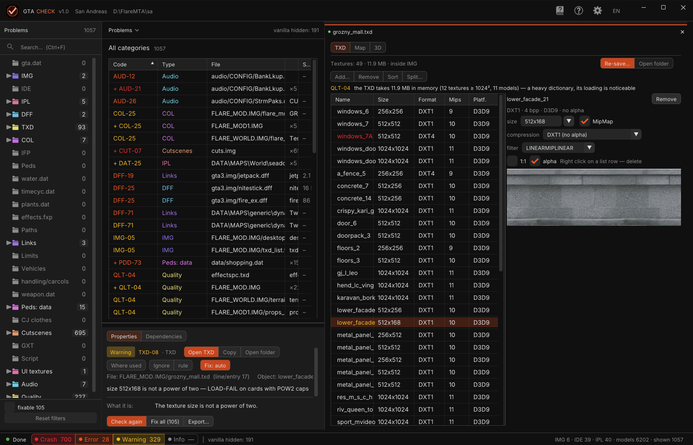
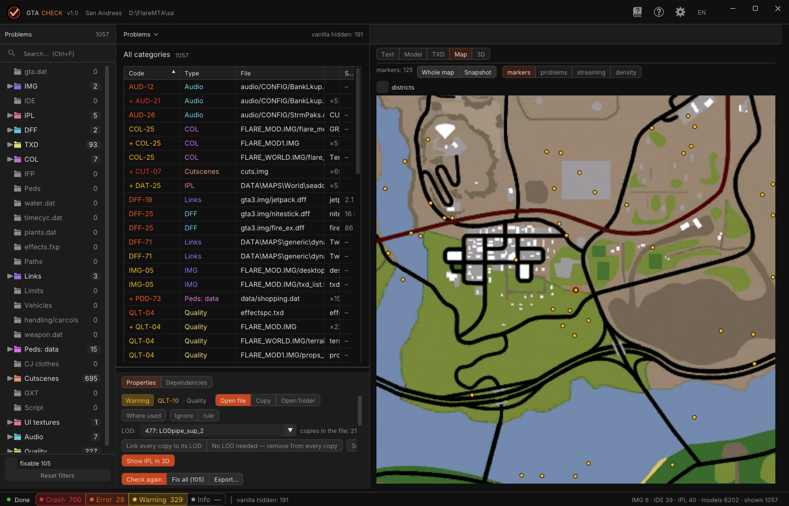
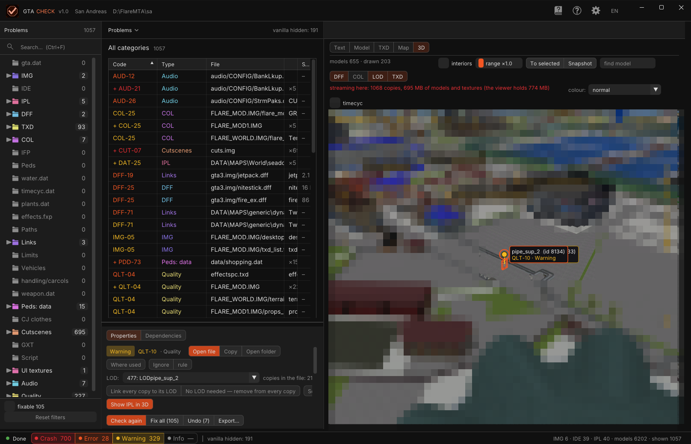
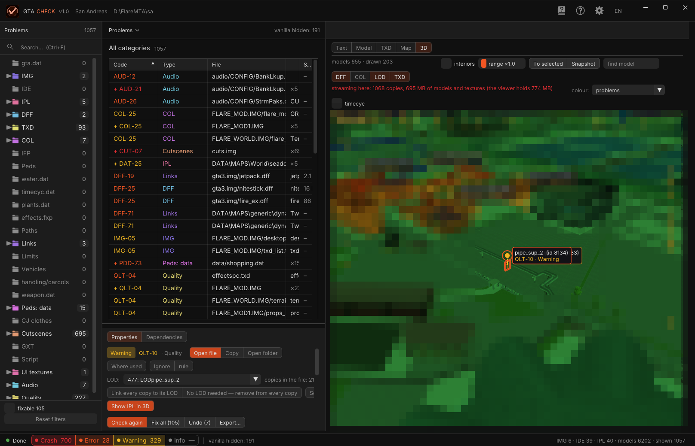
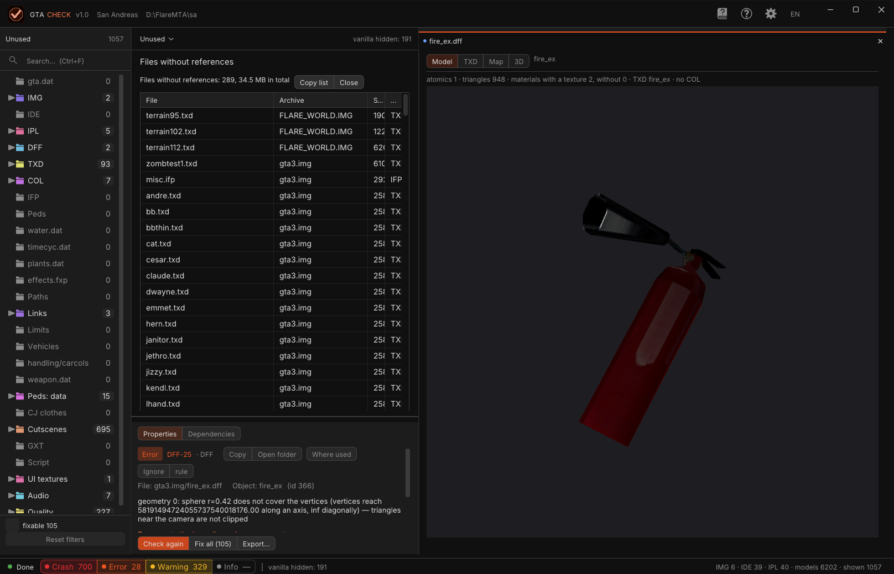
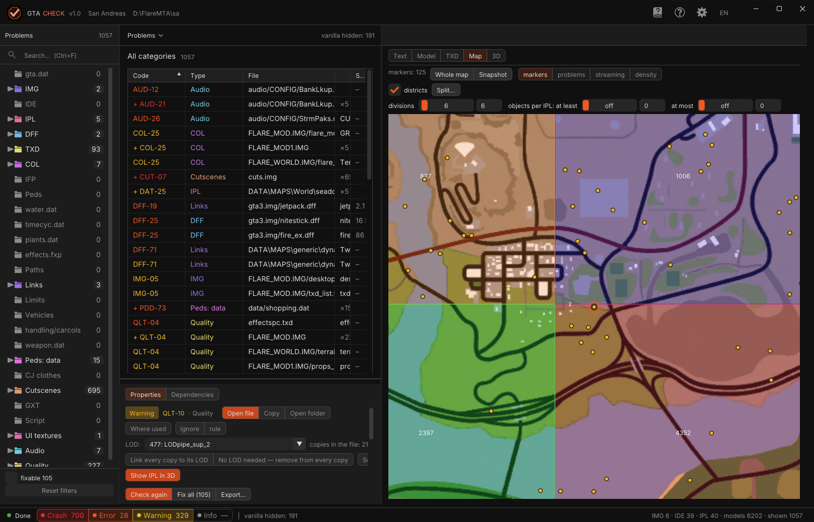

# INU Check (gta_check) — User Manual

Release **v1.0** · [Русская версия](MANUAL_rus.md) · [README](../README.md) · [Rule catalogue](re/GTACHECK_RULES.md)

INU Check is an offline checker for a GTA San Andreas / Vice City / III game folder. It reads the folder the same
way `gta_sa.exe` does at startup and reports everything that would crash the game, show garbage, or hurt
performance — before you launch it. It also fixes many of those problems, and ships with viewers for text
files, models, textures, the 2D map and a 3D view of the world built from the IPL files.

All screenshots in this manual were taken with the released `gta_check.exe` v1.0.

---

## Contents

1. [What it is](#1-what-it-is)
2. [Installation and first run](#2-installation-and-first-run)
3. [Files the program creates](#3-files-the-program-creates)
4. [The window](#4-the-window)
5. [The check](#5-the-check)
6. [The issue table](#6-the-issue-table)
7. [Row details](#7-row-details)
8. [Fixes, backup and undo](#8-fixes-backup-and-undo)
9. [Text editor](#9-text-editor)
10. [Model preview](#10-model-preview)
11. [TXD editor](#11-txd-editor)
12. [Map](#12-map)
13. [3D world view](#13-3d-world-view)
14. [Unused files and "Where used"](#14-unused-files-and-where-used)
15. [Tools: TXD diet and districts](#15-tools-txd-diet-and-districts)
16. [Settings](#16-settings)
17. [Reference: rule codes, keys and mouse](#17-reference-rule-codes-keys-and-mouse)
18. [Command line (CLI)](#18-command-line-cli)
19. [Reports](#19-reports)
20. [Rule families](#20-rule-families)
21. [Vice City and III](#21-vice-city-and-iii)
22. [Troubleshooting](#22-troubleshooting)
23. [Building from source](#23-building-from-source)
24. [Glossary](#24-glossary)

---

## 1. What it is

The game loads its data in a fixed order: `gta.dat` → IMG archives → IDE/IPL → models (DFF), textures (TXD),
collision (COL), animation (IFP) → handling, weapons, peds, clothes, cutscenes, GXT text, `main.scm`, audio.
Every loader has places where it does not check its input; a bad file there crashes the game with no message.

INU Check walks the same path with the same rules (derived from reverse-engineering the 1.0 US loaders,
see `docs/re/`) and reports every problem with:

- a **severity** — 💥 Crash · ❌ Error · ⚠️ Warning · ℹ️ Info;
- a **rule code** (`DFF-19`, `TXD-08`, `QLT-10` …) with a plain-language explanation
  *what it is / what it breaks / what to do*;
- the **file** (loose path or `archive.img/entry`), **line** and **object** it concerns;
- an **automatic fix** where one is safe.

A clean SA 1.0 US gives **0 crashes**; problems the clean game also has are hidden by default (vanilla baseline).
III and VC have their own baselines (experimental support, see [§21](#21-vice-city-and-iii)).

The program has a GUI (its own window on librw + Dear ImGui) and a CLI (`--cli`) that runs the same check
from a script and writes TXT / CSV / JSON / HTML reports.

## 2. Installation and first run

Download `gta_check.exe` from the [v1.0 release](https://github.com/INU-ez/INU_Check-GTA/releases/tag/v1.0).
No installer, no dependencies — Windows x64 with Direct3D 9.

**GUI.** Put `gta_check.exe` into the game root (next to `gta_sa.exe` and `data\gta.dat`) and run it. The check
starts automatically. You can also pass the folder as the first argument:

```
gta_check.exe "D:\Grand Theft Auto San Andreas"
```

The game folder is resolved as: argument → folder of the exe → current directory. The game is detected from
`data\gta.dat` (SA), `data\gta_vc.dat` (VC) or `data\gta3.dat` (III).

**CLI.**

```
gta_check.exe --cli "D:\Grand Theft Auto San Andreas" --txt report.txt --lang en
```

Full option list in [§18](#18-command-line-cli).

**What happens on first run.** The program reads `gta.dat`, the IMG directories, IDE/IPL, then every DFF / TXD /
COL / IFP in the archives and in `modloader\`, then the data files, GXT, script and audio configs. On a vanilla
SA from an SSD this takes about 10 s; a large mod with many archives takes longer. Progress is shown in the
status bar and above the table; the check runs in a background thread, so the window stays responsive.

## 3. Files the program creates

The program never modifies game files without an explicit action (a "Fix" button, "Save", "Re-save",
`--fix-all`).

Next to the exe:

| File | What |
|---|---|
| `gta_check.ini` | all settings (language, scheme, layout, check options, window size) |
| `gta_check_crash.txt` | crash report with stack trace, if the program itself crashes |
| `gta_check_d3d.txt` | Direct3D device reset failure log |

In the game folder, only when you ask for it:

| File / folder | What |
|---|---|
| `gta_check_report.txt / .csv / .html` | exported reports |
| `gta_check_backup\` | originals of every file the program has written, plus `undo.txt` — the undo journal |
| `gta_check_ignore.txt` | ignore list (editable by hand, see [§6](#6-the-issue-table)) |
| `gta_check_out\` | fixed files when they do not fit in place and there is no modloader |
| `modloader\gta_check_fix\` | fixed files when modloader is present |
| `gta_check_txd_diet\` | result of the TXD diet |
| `gta_check_shot_N.png` | screenshots from the map / 3D view |

With an **output folder** set (Settings → Saving → "to folder"), every write goes there instead of the game:
IMG entries by name, loose files by their relative path — a folder ready to drop into `modloader\`.

## 4. The window



The window has no system title bar: the **top strip** is the caption (drag to move, double-click to maximise,
`─ ▢ ✕` on the right). It shows the logo, **GTA CHECK v1.0**, the detected game and the game folder
(double-click the path → Explorer). At the right, four tiles: **Rule reference**, **Help**, **Settings** and the
**language** (RU → EN → ES, switches at once).

**Sidebar (left).** The section title with its row count (`Problems 1057`), the search field (Ctrl+F), then the
**category tree** — all 27 categories, each with a badge count; categories with rows have a folder icon in the
category colour and an arrow that expands their files / archives. Click = only this category (its folder
opens); click again = all categories; Ctrl+click = toggle one; click a file under a category = only rows of
that file (its name goes into the search); right-click = re-check only that category. At the bottom: the
filters **fixable N** (rows with an automatic fix) and, after a re-check, **new N**; **Reset filters** clears
everything including the search.

**Middle.** The crumb **Problems ⌄** — its popup switches **Problems / Unused** and filters by **IMG / mod**
(all, `gta3.img`, `FLARE_MOD.IMG`, a modloader mod …). To the right, muted: `vanilla hidden: 191`,
`ignored: N`, `fixed N · new N`. The heading (`All categories`, a category name, or `Categories: N of M`) with
the row count, then the **issue table** ([§6](#6-the-issue-table)). Below the splitter — the **properties
strip**: tabs **Properties** (the row details, [§7](#7-row-details)) | **Dependencies (N)** (where the
model of the row is used), and the action buttons **Check again | Fix all (N) | Undo (N) | Export…**.

**Right panel.** The document of the selected row: a tab line with the file name (`● jetpack.dff`, ✕ closes),
the segments **Text | Model | TXD | Map | 3D** (only those that apply to the row; Map and 3D are always there),
and the viewer itself: the text editor, the model preview, the TXD editor, the map or the 3D world.

**Status bar.** State dot, `Done` / `Checking…`, the four severity **chips** — click one to show / hide that
level (a dash means the level is off) — the vanilla note, and on the right the folder summary:
`IMG 6 · IDE 39 · IPL 40 · models 6202 · shown 1057`.

The **colour scheme** (Settings → colours) changes colours and fonts, not the layout: Studio (black, orange,
default) · Game (pause-menu palette of SA / VC / III with the loading-screen art behind the window) · Calm ·
Blender · Panel · Neon (retro CRT: monospace font, scanlines, glow, curved 3D screen) · Graphite · Indigo ·
Ocean.

## 5. The check

### Severities

| | Meaning |
|---|---|
| 💥 **Crash** | the game crashes, hangs, or shows LOAD-FAIL on this file |
| ❌ **Error** | visible garbage, missing model / texture, memory corruption that surfaces later |
| ⚠️ **Warning** | suspicious, silently ignored by the game, may work by luck |
| ℹ️ **Info** | a note: limits, statistics, what the program skipped (collected with "info" enabled) |

### Categories (27)

`gta.dat` · IMG · IDE · IPL · DFF · TXD · COL · IFP · Peds · `water.dat` · `timecyc.dat` · `plants.dat` ·
`effects.fxp` · Paths · Links (cross-references) · Limits · Vehicles · handling/carcols · weapon.dat ·
Peds: data · CJ clothes · Cutscenes · GXT · Script · UI textures · Audio · **Quality**.

Quality (`QLT-nn`) is a separate family: not crashes, but build quality and performance — draw distance vs.
model radius, heavy TXDs, objects under water, overloaded sectors, duplicate placements, alpha flags, dead
textures, unused archive files, prelit without night colours.

### Vanilla baseline

Every issue is hashed (`code | file | object | message`) and compared with the baseline of a clean game
(SA 1.0 US, III, VC). Rows the clean game also has are **hidden** by default ("hide vanilla" in Settings); the
count is shown next to the crumb. This switches without re-checking.

### Options that change what is checked (Settings → Check)

- **modloader** — `modloader\` is read as the game does: loose dff / txd / col / ifp override IMG entries,
  ide / ipl by name override or add, readme lines for IDE / IPL / IMG.
- **limit adjuster** — with fastman92's limit adjuster installed, pool overflows (TXD 5000, COL 255 / 10150,
  anims 2500 …) are notes, not crashes.
- **info** — collect Info rows.
- **mod only** — skip the contents of vanilla `gta3.img / gta_int.img / player.img / cutscene.img` (they are
  still read for cross-references).
- **What to check** — DFF, TXD, COL, IFP, data (families can be disabled for a faster pass).

These apply at the next check ("Check again").

### Partial re-check and folder watch

Right-click a category → "Re-check only …" (categories that depend on everything trigger a full re-check).
After a check the program watches the game folder: a written, created, deleted or renamed file shows
"data changed — re-check" in the status bar. A re-check compares with the previous result: rows that
disappeared are counted as **fixed**, rows that appeared as **new** (filter "new" in the sidebar).

## 6. The issue table

Columns: **Code** (coloured by severity: red crash, orange error, yellow warning, grey info), **Type**
(category, in its colour), **File**, **Object** and **Size** (of the IMG entry / DFF). The message itself lives
in the details pane below.

- **Grouping.** Identical rows (same code and message) collapse into `+ CODE` with `×N` in the object column;
  click the code to expand.
- **Sorting.** Click a column header; again for the reverse order. Default is worst-first.
- **Filters.** Severity chips in the status bar; categories and files in the sidebar; IMG / mod in the crumb
  popup; **fixable** and **new** at the bottom of the sidebar; search (Ctrl+F) matches code, file, object and
  message.
- **Selection.** Click = select (details, the document in the right panel, highlight on the map and in 3D).
  Ctrl+click = add / remove a row (same code only); Shift+click = range. Multi-selection is used by "Fix" and
  "Ignore".
- **Double-click** opens the row's file: text → editor, TXD → TXD editor, a place (QLT-06) → 3D, otherwise the
  folder in Explorer.
- **Right-click** menu: fix, open file / TXD, copy, open folder, show in 3D / on the map, where used, ignore;
  for IPL rows also the LOD tools of [§7](#7-row-details).
- **Ignore.** "Ignore" in the details adds the row (or, with "rule", the whole rule) to
  `gta_check_ignore.txt` in the game folder; ignored rows stay in the table dimmed when "show ignored" is on.
  The file is plain text, one entry per line: `rule<TAB>CODE` or
  `issue<TAB>CODE<TAB>file<TAB>object<TAB>message`.

## 7. Row details

The **Properties** tab under the table shows, for the selected row:

1. the severity plate, the **code** (click → the reference opens on that code), the category;
2. action buttons: **Open file** (text) or **Open TXD** · **Copy** (the row as text) · **Open folder** ·
   **Where used**; **Ignore | rule**;
3. **Fix: auto** and, for DFF frame names, **Fix: manual…** — when a fix exists ([§8](#8-fixes-backup-and-undo));
4. `File: … (line/entry N)  Object: … (id N)`, the message and the detail line (numbers, offsets, what exactly
   was read);
5. **What it is / What it breaks / What to do** — the plain-language explanation of the rule.

**IPL rows** get the LOD tools: `LOD: <combo>` — which inst line of the same file is the LOD of this copy
(the list = LOD models of the file by distance; choosing writes the IPL at once, with backup and undo);
`copies in file: N, linked: M · LOD model: …`; **Link all copies to LOD** (every copy of the model gets the
LOD line at the same point, added if missing) · **No LOD needed — clear on all copies** (lod := −1) ·
**Sort: model → its LOD** (reorders the whole file so that each model is followed by its LOD line, indices
recomputed) · **Show IPL in 3D**.

## 8. Fixes, backup and undo

### Automatic fixes

| Fix | Rule | What it does |
|---|---|---|
| DFF frame names | DFF-30 … | rewrites the NodeName chunks (too long / missing names); **manual…** opens a table "was → becomes" where you type the names |
| TXD power of two | TXD-08 | re-encodes textures to power-of-two sizes |
| TXD DXT without alpha | TXD-20 | DXT3/DXT5 whose alpha is all 255 → DXT1; real alpha → the alpha flag is set |
| TXD dead textures | QLT-12 | drops textures no material of the dictionary's models uses |
| IDE draw distance | QLT-01 | draw distance := ceil(2 × radius / 10) × 10 in all dist fields of the line |
| IDE alpha flag | QLT-11 | flags |= 4 for models whose textures have smooth alpha |

**Fix all (N)** in the properties strip (or `--fix-all` in CLI) applies every automatic fix in the current
(filtered) table after a confirmation. Text fixes keep the spacing of the line; TXD fixes go through the
built-in codec and touch only the textures that need it. The filter **fixable** shows exactly the rows
"Fix all" will touch.

### Where the result goes

1. **In place** with a copy of the original in `gta_check_backup\` (default). An IMG entry is rewritten in place
   when it fits into its old sectors; otherwise the file goes to `modloader\gta_check_fix\` (modloader present)
   or `gta_check_out\`.
2. **Output folder** (Settings → Saving → "to folder"): nothing in the game is touched; IMG entries are written by
   name, loose files by their relative path.

### Undo

Every write appends a record to `gta_check_backup\undo.txt`. **Undo (N)** puts back the last record (the archive
or file returns bit-for-bit; the rule reappears after a re-check). Records are undone one at a time, newest
first. CLI: `--undo`.

## 9. Text editor



Opens for IDE / IPL / DAT / CFG / INI rows in the right panel (segment **Text**). The toolbar: the file path,
`Lines with problems: N` with **↑ prev / ↓ next**, **Save**, **Undo edits**, **Open folder**.

- Gutter with line numbers; the lines the table points at are highlighted in the severity colour; click a
  number → the table row that points here.
- **F3 / Shift+F3** — next / previous problem line. **Ctrl+S** — save (original copied to backup, undo record).
- Ctrl+C / X / V / A as usual; **Ctrl+wheel** — editor font size.
- Right-click a line → show on the map / in 3D / where used (IPL / IDE lines with a model); for IPL files
  also the LOD tools.
- The rule of the selected row is repeated under the editor (`QLT-11 texture «a_metal_25» …`).
- CRLF is detected on read and preserved on write. `.cut` files from `cuts.img` are read-only (line numbers as
  the engine counts them — blank lines skipped).
- **Undo edits** discards the session; **Esc** closes the editor without discarding.
- Saving an IPL recomputes LOD indices if lines were added / removed.

## 10. Model preview

Opens for DFF rows and for objects with a model (segment **Model**). The model is read from IMG (or the loose
modloader file), its TXD is run through the codec (PAL8 / D3D8 converted, empty mip levels filled) and set
current. The info line: `atomics 3 · triangles 15964 · materials with a texture 10, without 1 · TXD jetpack ·
no COL`; textures missing from the TXD are listed and drawn **magenta** on the model.

- **LMB / RMB drag** — orbit, **MMB drag** — pan, **wheel** — zoom, **to model** — reset the camera.
- **Polygon pick** — click a face: it is highlighted, the orbit centre moves to it, the toolbar shows the material
  / texture; double-click zooms in.
- **collision** checkbox — the COL of the model (spheres / boxes / faces) drawn over it.
- Peds are static (skin / hanim are not hooked up); parent TXDs (`txdp`) are not loaded.

## 11. TXD editor



Opens for TXD rows (segment **TXD**; also from a model row). The header: `Textures: 49 · 11.9 MB · inside IMG`,
**Re-save…**, **Open folder**; the row of tools **Add… | Remove | Sort | Split…**; the rule of the selected
row.

- **List**: Name, Size, Format (`DXT1`, `DXT4`, `8888`, `PAL8` …), Mips, Platform (`D3D9` / `D3D8`). The
  texture of the selected row is highlighted; drag a row to reorder. Right-click a row = remove.
- **Texture pane** (right): name, `DXT1 · 4 bpp · D3D9 · no alpha`, **Remove**; the per-texture re-save
  settings — **size** (limit the side: 512, 256 …), **MipMap**, **compression** (DXT1 without alpha, DXT5,
  32-bit …), **filter**, **alpha** flag; **1:1** — preview at real size. The preview shows the decoded texture.
- **Add…** — a PNG / TGA / BMP file becomes a texture; dropping an image onto the window while a TXD is shown
  does the same. Remember to **Re-save…**.
- **Re-save…** — the codec repairs: D3D8 → D3D9, palettes → DXT / 32-bit, AUTOMIPMAP, full mip chain, power of
  two, filter and mask flags, the side limit. Writes in place with backup (into `modloader\gta_check_fix\` /
  `gta_check_out\` when the entry does not fit the IMG) or into the output folder; **To folder…** writes the
  re-saved dictionary into a folder of your choice.
- **Split…** — cut the dictionary into several `<name>_N.txd` by the models that use it (models sharing a
  texture stay together); the models' IDE lines get the new name; textures nobody uses are left out.
- CLI equivalent: `--txd-fix <in> <out> [--ppm]` prints the format of every texture and what was fixed;
  an untouched file is reported `copy: BIT-EXACT`.

**Drag and drop.** Any file dropped onto the window opens in the right panel: text → editor, `.txd` → TXD editor,
`.dff` → model preview, `.col` → collision archive view, `.img` → archive listing. A file inside the game folder
is editable with the usual backup and journal.

## 12. Map



Segment **Map**. The radar tiles (`radar00..NN.txd`, SA 12×12, III / VC 8×8) are decoded into one texture.
The toolbar: `markers: 125`, **Whole map | Screenshot**, the layers **markers | problems | streaming |
density**, the **districts** checkbox.

- **Markers** = placed copies (IPL) of the models that have a row in the current filtered table. A row with an
  IPL file and line → that copy; otherwise by id → all copies (≤ 2000). Colour = worst severity; the selected row
  is an orange ring and the map centres on it. Click a marker → select the row.
- **LMB drag** — pan, **wheel** — zoom, **Whole map** — fit. **Double-click on empty** → the 3D camera moves
  there (a white diamond marks the 3D camera target).
- **Layers**: problems (worst severity per cell), streaming (MB of unique DFF + TXD reaching the cell) and
  density (objects per cell) as heat over the map.
- **Screenshot** → `gta_check_shot_N.png` in the game folder.
- **districts** — see [§15.2](#152-districts).

## 13. 3D world view



Segment **3D**: the world built from the IPL files around an orbital camera. Models stream in like the game
(nearest first, 14 ms per frame budget); LOD models are shown where their children are too far — the same
rule as the game (SA: LOD parent from the IPL; III / VC: "big buildings" over 300 units, `FindRelatedModel`,
island LODs).

### Controls

- **LMB drag / RMB drag** — orbit, **MMB drag** — pan on the ground, **wheel** — distance.
- **Click on a model** — select it: orange box + info card (name (id), IPL:line and coordinates, DFF archive ·
  KB · triangles, TXD archive · KB · models, COL file · spheres · boxes · faces, LOD, draw distance, flags, the
  row code). The row is selected in the table if there is one. **Click on empty** — deselect.
- **Markers** (rows of the table): a ray + circle + card (`pipe_sup_2 (id 8134)` / `QLT-10 · Warning`) for the
  nearest 40; copies outside the frame stick to the edge in their direction. Click = select the row;
  **double-click** = fly there. Selecting a row in the table also flies.
- **find model** field: Enter → fly to the nearest copy. **To selected** — fly to the selected row.

### Toolbar

- `models 655 · drawn 203` — loaded / drawn copies.
- **interiors** — show copies with an interior code (hidden by default); **draw distance ×** — the LOD
  multiplier; **To selected | Screenshot**.
- **DFF | COL | LOD | TXD** layers. DFF off → only LOD models (the world as seen from far away); COL → the
  collision wireframe for every drawn copy within 400 units (≤ 300); TXD off → all models grey.
- **Streaming line** — `streaming here: 1068 copies, 695 MB of models and textures (the viewer holds 774 MB)`:
  what the game must keep in memory at the camera target. Yellow from 64 MB, red from 128 MB.
- **timecyc** — lighting and sky from `data/timecyc.dat` by hour and weather, as in the game; when on: the
  hour slider, ☀ / ☾ (12:00 / 0:00), the weather combo, **filter** (the SA colour filter) and **fog**.
- **colour:** — the colouring modes (a legend folds / unfolds in the view):



| Mode | Colour |
|---|---|
| normal | textures, as in the game |
| problems | worst table row of the model: red crash, orange error, yellow warning, green — no rows |
| DFF+TXD weight | green light · yellow ~2 MB · red ≥ 4 MB |
| draw distance | green ≤ 100 · yellow ~300 · red > 300 (SA treats these as big buildings) |
| polygons | green < 5k · yellow ~10k · red ≥ 20k triangles |
| IPL | a colour per IPL file, legend with object counts and MB |
| archive | a colour per IMG (modloader loose files separately) |
| vanilla / mod | grey — vanilla archive, orange — mod |
| LOD | blue — LOD model, green — has a LOD pair, dim green — no LOD under 300, orange — no LOD at ≥ 300 |
| collision | red — no COL, yellow — empty COL, green — has one |
| density | objects in the model's 50×50 m cell: green few · yellow ~80 · red ≥ 160 |
| IPL flags | blue under water · purple tunnel · grey unimportant stream · yellow tobj |
| alpha | red — model with alpha flags (4 / 8), green — without |
| TXD in streaming | red — TXD used by one model only · yellow 2–4 · green ≥ 5 |
| districts | each model in its district colour, district borders as translucent walls; the **whole map** checkbox loads every copy at any distance |

"Textures in 3D colour modes" (Settings) multiplies the colour by the texture; districts are always flat.

## 14. Unused files and "Where used"



**Unused** (crumb → Unused): archive files nothing references — DFF not in any IDE, TXD without models (not a
system TXD and not a paint job `<car>N.txd`), COL without matched models, IFP not in `animgrp.dat` / IDE. Names
found in `main.scm` / `script.img` count as used (special models). Columns File, Archive, Size, Why unused;
the total (`289 files, 34.5 MB`), **Copy list | Close**. The same as rule QLT-09.

**Where used** (button in the details, right-click in the editor, tab **Dependencies**): a text search for a
model / texture name across all IDE, IPL, `data\*`, cutscenes and the archives; every hit is a file + line,
click opens it.

## 15. Tools: TXD diet and districts

### 15.1 TXD diet

Settings → Saving → **TXD diet…**: every TXD (or only those of placed models) is run through the codec with a
side limit (halve until ≤ 256 / 512 / 1024) and DXT compression, into `<outdir>\txd_diet`,
`modloader\gta_check_txd_diet` or `gta_check_txd_diet`. No journal — it is a new folder you can drop into
modloader. A direct answer to an overloaded streaming budget (QLT-04 / the streaming line in 3D).

### 15.2 Districts



Map → **districts** checkbox → the map is divided by a `divisions × divisions` grid (SA ±3000). Each cell shows
how many placed objects it holds; a LOD and its children always stay in one cell. **objects per IPL: at least
/ at most**: cells under the minimum are merged with a neighbour; cells over the maximum get a red frame.

**Split…** writes, for each district `d<x>_<y>`:

- **IPL** — `data\maps\district\d<x>_<y>.ipl` with the inst lines of the cell (lod indices recomputed; other
  sections stay in the source files; interiors are not touched; text IPLs referenced by streamed IPLs are skipped
  — their ordinals must not move);
- **IDE** — objs / tobj / anim lines of models whose every copy is in the cell → `d<x>_<y>.ide`;
- **COL** — the COL records of those models → `d<x>_<y>.col`, removed from the source `.col`;
- **LOD TXD** — the textures of LOD models → `lod_d<x>_<y>.txd` (or one `lod_all.txd` with "one"), the txd token
  in IDE is patched;
- `gta.dat` gets the new IDE / IPL lines (limit: 256 CIplStore slots).

Text edits go in place with backup and journal; new `.col` / `.txd` go to the output folder /
`modloader\gta_check_fix` / `gta_check_out`. In 3D the "districts" colour mode shows the plan before writing.
CLI: `--district N [--district-min M] [--district-what ipl,ide,col,txd,one] [--district-log f]`.
For III / VC only IPL and IDE are split.

## 16. Settings

The gear tile in the top strip. Applied at once unless noted.

**What to check** (next check): DFF · TXD · COL · IFP · data · info.

**Build** (next check): modloader · limit adjuster · mod only.

**Saving**: in place (copy in `gta_check_backup`) | to folder: … (Choose…) · **TXD diet…**.

**Display**: hide vanilla · show ignored · tooltips on hover (off by default — the reference lists every
shortcut) · textures in 3D colour modes · backdrop from the game's loading screens (Game scheme).

**Colours**: scheme — Studio (black, orange) · Game (pause-menu palette of SA / VC / III) · Calm (neutral greys) ·
Blender (grey panels, blue) · Panel (dark blue) · Neon (retro CRT, monospace) · Graphite (green) · Indigo
(purple) · Ocean (teal). For Neon: **CRT effect** (scanlines, curved 3D screen, glow) and phosphor **colour**
(amber / green / red / blue / white). **Font** (Inter, Roboto, IBM Plex Sans, Manrope, Rubik, Exo 2, Play,
JetBrains Mono, JetBrains Mono Bold, Russo One) and **scale** 100 / 125 / 150 %.

All values live in `gta_check.ini` next to the exe.

## 17. Reference: rule codes, keys and mouse

The book tile in the top strip. Two tabs:

- **Rule codes** — every code with *what it is / what it breaks / what to do*. Opening from a row highlights that
  code (`COL-23a` finds `COL-23`). The complete catalogue with function addresses is
  [docs/re/GTACHECK_RULES.md](re/GTACHECK_RULES.md).
- **Keys and mouse** — the table below.

| Where | Keys / mouse | What |
|---|---|---|
| Everywhere | Ctrl+F | search the table |
| Everywhere | Esc | close window, editor or popup |
| Everywhere | double-click the top strip | maximise / restore |
| Everywhere | double-click the folder path | open the game folder in Explorer |
| Table | click | select the row |
| Table | double-click | open the row's file (text → editor, TXD → TXD editor, place → 3D, else the folder) |
| Table | Ctrl+click / Shift+click | add to selection / range (same code) |
| Table | right-click | row menu |
| Table | click a header | sort (again — reverse) |
| Table | click `+ CODE` | expand / collapse the group |
| Categories | click / Ctrl+click / arrow / right-click | only this one / toggle / expand files / re-check it |
| Status bar | click a level | show / hide crashes, errors, warnings, info |
| Editor | Ctrl+S · F3 / Shift+F3 · Ctrl+wheel · Ctrl+C/X/V/A | save · next / previous problem · font size · clipboard |
| Editor | right-click · click a line number | map / 3D / where used · select the row pointing here |
| 3D | LMB / RMB drag · MMB drag · wheel | orbit · pan · distance |
| 3D | click model / marker · double-click · click empty · Enter in "find" | select · fly · deselect · fly to model |
| Map | LMB drag · wheel · click marker · double-click empty | pan · zoom · select row · move the 3D camera |
| Model / TXD preview | LMB drag · wheel | rotate · zoom |
| TXD window | drag a texture | reorder |

## 18. Command line (CLI)

```
gta_check.exe --cli <game folder> [options]

Reports
  --txt f | --csv f | --json f | --html f   write a report (HTML includes the rule explanations)
  --lang ru|en|es                           message language
  --info                                    include the Info level
  --show-vanilla                            also show what a clean game has

Check
  --no-modloader                            ignore modloader\
  --limit-adjuster                          pool overflows are notes, not crashes
  --mod-only                                skip the contents of vanilla IMGs
  --no-dff --no-txd --no-col --no-ifp --no-data   disable families

Fixes
  --fix-all                                 apply every automatic fix
  --out <folder>                            every write goes to this folder instead of the game
  --undo                                    put back the last record of gta_check_backup\undo.txt

Districts (after the check)
  --district N [--district-min M] [--district-what ipl,ide,col,txd,one] [--district-log f]

Development
  --baseline-dump f                         dump for the vanilla baseline (make_baseline.py)
  --lang-missing f                          untranslated strings

Standalone
gta_check.exe --fix-dff <in.dff> <out.dff>            fix frame names of one file
gta_check.exe --txd-fix <in.txd> <out.txd> [--ppm]    re-save a TXD through the codec (prints every texture)
```

**Exit code**: `0` — no crashes, `1` — crashes found (hidden vanilla ones excluded), `2` — bad arguments or an
unreadable file.

Console output: the exe is a GUI program; it attaches to the parent console when started from one. From
PowerShell `Start-Process -Wait -NoNewWindow` or a redirect does not capture that — write the result with
`--txt` / `--html`. Quote paths with spaces.

Examples:

```
:: report for a mod folder, English, with info
gta_check.exe --cli "D:\GTA SA" --html report.html --lang en --info

:: fix everything into a modloader folder
gta_check.exe --cli "D:\GTA SA" --fix-all --out "D:\GTA SA\modloader\fixes"

:: split the map into 6×6 districts, IPL and IDE only
gta_check.exe --cli "D:\GTA SA" --district 6 --district-what ipl,ide --district-log split.txt
```

## 19. Reports

- **TXT** — header with version, game, folder and counts, then sections per severity: `[CODE] file:line (object)`,
  the message, `→ detail`.
- **CSV** — one row per issue: `severity;category;code;file;line;id;object;message;detail`.
- **JSON** (CLI only) — the same fields as objects plus `vanilla`.
- **HTML** — one page: the table by severity, every code is a link to the "Rule reference" section with the
  explanation.

Export from the window: **Export…** in the properties strip → **TXT report | CSV table | HTML report | Open game
folder** (`gta_check_report.*` in the game folder).

## 20. Rule families

| Family | Files | Examples |
|---|---|---|
| `DAT` | `gta.dat` / `default.dat`, `water.dat`, `timecyc.dat`, `plants.dat`, `object.dat`, `effects.fxp`, `nodes*.dat`, `procobj.dat` | missing file, bad line, LOD link out of range (DAT-22), position outside ±3000 (DAT-25) |
| `IDE` `IPL` `IMG` | all IDE sections, text + binary streamed IPL, IMG directories | duplicate id, bad flags, unknown extension in IMG (IMG-05) |
| `DFF` | RW structure, BinMesh, 2DFX, night colours, UV anim, breakable, ped skin, vehicle collision | DFF-02 no extension, DFF-19 texture missing in TXD, DFF-25 bounding sphere too small, DFF-29/30 frame names |
| `TXD` `UI` | rasters, formats, mip chains, D3D8 / PAL8, UI TXDs, radar tiles | TXD-08 not power of two, TXD-12 bad filter / addressing, TXD-20 DXT without alpha |
| `COL` | COL 1–4 — face groups, shadows, bounds, counts | COL-02, COL-25 name matches no model, COL-27 |
| `IFP` | ANPK / ANP2 / ANP3, timing, quantisation, `animgrp.dat` | IFP-07 decreasing times |
| `VEH` `HND` | frames / extras / dummies vs. `ms_vehicleDescs`, `handling.cfg`, `carcols`, `carmods`, `cargrp`, `vehicles.ide`, remap TXDs, audio ids | missing handling line, dummy out of range |
| `WPN` `PDD` `PED` | `weapon.dat`, `ped.dat`, `pedstats`, `pedgrp`, `popcycle`, `peds.ide`, `decision\*`, `surface*.dat`, `shopping`, stats; ped skins | bone count, weapon slot, PDD-73 shopping.dat |
| `CLO` | `player.img`, `clothes.dat` | missing normal / fat / ripped clump |
| `CUT` | `anim\cuts.img` (.cut / .ifp / .dat), `cutscene.img` | CUT-07 special model limit |
| `GXT` `SCM` | `text\*.gxt`, `main.scm` / `script.img`, `stream.ini`, `fonts.dat` | GXT-04 TABL size |
| `AUD` | `audio\CONFIG\*.dat`, SFX banks, stream packs, `TrakLkup` | AUD-12 bank missing, AUD-21 |
| Links | model ↔ DFF ↔ TXD (+ txdp / vehicle) ↔ COL ↔ IPL, material textures ↔ TXD, pool limits | DFF-71 model without IPL, COL-27, IDE-03, TXD-28 |
| `QLT` | build quality | 01 distance < radius, 02 small object with distance > 300, 03 procobj, 04 heavy TXD, 05 under water, 06 overloaded sector, 07 GXT name, 08 file in several mods, 09 unused files, 10 duplicate placement, 11 alpha flag, 12 dead textures, 13 texture in ≥ 5 TXDs, 14 IMG overlap / holes, 16 prelit without night colours |

## 21. Vice City and III

Detected from `gta_vc.dat` / `gta3.dat`. Based on the re3 / reVC sources:

- own vanilla baselines: clean III and VC give **0 crashes**;
- formats: VER1 `.dir` IMGs, COLL / COL2, ANPK, RW 3.1 / 3.2 DFFs (clump extension past the chunk), D3D8 /
  PAL8 TXDs, `txd.img` (III);
- engine limits (pools, zones, 2dfx, IFP, timecyc), `handling.cfg` with names baked into the exe, peds without
  skin, `waterpro.dat`; VC IPL field `interior` = area (13 = everywhere);
- 3D: LOD visibility by the game's rules (`SetupBigBuilding`, `FindRelatedModel`), island LODs, lighting
  (ambient + prelit ×1) and decals as in the game, `generic.txd` from the TEXDICTION files.

Not calibrated: `weapon.dat`, GXT (III has no TABL), `carcols`, `object.dat`, cull zones, `particle.cfg` — these
families are skipped for III / VC. Districts: IPL and IDE only. False positives are possible — report them with
the rule code.

## 22. Troubleshooting

- **The program crashed.** `gta_check_crash.txt` next to the exe has the exception code, address and a stack
  with module names — attach it to an issue. If the file is missing, look in the Windows Application log
  (event 1000).
- **Black or white window, models missing after resize.** `gta_check_d3d.txt` records a failed device reset;
  attach it to an issue.
- **Textures show UI letters / models are black far away.** Handled by the viewer (dropped unusable textures,
  filled empty mip tails); if it persists, the TXD is broken — see the TXD rows.
- **"Game folder not found".** The exe must be next to `gta_sa.exe` (`data\gta.dat`), or pass the folder as an
  argument.
- **No console output in CLI.** Write to a file (`--txt`, `--html`, `--district-log`).
- **False positive on a clean game.** Report the rule code and the file — the baseline or the rule needs
  adjusting.

Known limitations: static ped preview; parent TXDs not loaded in the preview; the ignore list is not applied in
CLI; the TXT report has no rule explanations; districts for III / VC cover IPL and IDE only; text IPLs are not
converted to binary streamed IPLs.

## 23. Building from source

```
build.bat            → bin\win-amd64-d3d9\Release\gta_check.exe
build.bat debug      → debug build (/Zi /Od)
```

Visual Studio 2022+, MSVC x64, C++17. The VS path is the first line of `build.bat`. librw, Dear ImGui 1.92.2b,
nanosvg and the fonts are in the repository; `rw.lib` is prebuilt. Icon and version: `src/gtacheck.rc`
(`src/gen_icon.py` builds the icon from `src/icon.png`).

`librw\` is a fork with local patches (NULL guard on `CreateTexture`, checked `Reset()`, fixed double free in
`Clump::streamRead`, modifier keys in `imgui_impl_rw.cpp`, caption-less window and frames during drag). After
changing librw rebuild `rw.lib` from a VS Developer Shell:

```
msbuild librw\build\librw.vcxproj "/p:Configuration=Release win-amd64-d3d9" /p:Platform=x64 /m:1
```

Adding a rule: the message is written in Russian via `Context::add(...)` in the relevant `check_*.cpp` (the
Russian text is the key for the baseline and the translation); an explanation line in `rule_help.cpp`;
translations via `python make_lang.py sync` → translate `lang_keys.txt` → `merge <file> en|es` → `build`
(verify `--cli <folder> --lang en --info --lang-missing f` → `0`); if the rule fires on a clean game,
regenerate the baseline: `--cli <vanilla> --no-modloader --info --baseline-dump dump.txt` →
`python make_baseline.py dump.txt [iii|vc]`. Version: `GC_VERSION` in `gtacheck.h`, `src/gtacheck.rc`, README badges.

## 24. Glossary

- **IMG** — archive with models / textures / collision (`gta3.img`); VER2 in SA, `.img` + `.dir` in III / VC.
- **IDE** — object definitions (id, model, TXD, draw distance, flags). **IPL** — placements (instances) of those
  objects; text or binary streamed (`.ipl` inside `gta3.img`).
- **DFF / TXD / COL / IFP** — RenderWare model / texture dictionary / collision / animation.
- **LOD** — a low-detail model shown from afar; in SA linked from the IPL (`lod` field), in III / VC by name and
  draw distance.
- **prelit** — per-vertex colours stored in the DFF (day); **night vertex colours** — the second set for night.
- **2dfx** — effects attached to a model: lamps, particles, enter/exit markers.
- **modloader** — a mod folder loader; files in `modloader\<mod>\` override the game's.
- **vanilla** — the clean, unmodified game.
- **big building** — in III / VC / SA, a model with draw distance > 300; treated as a LOD by the engine.
