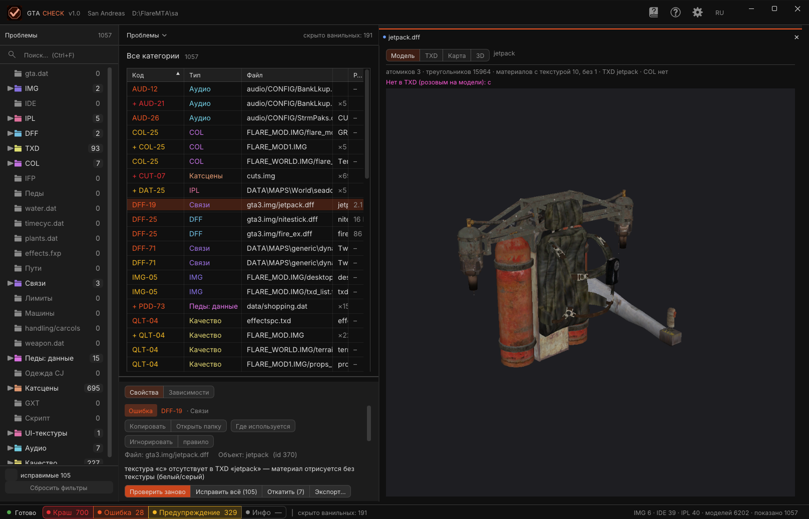
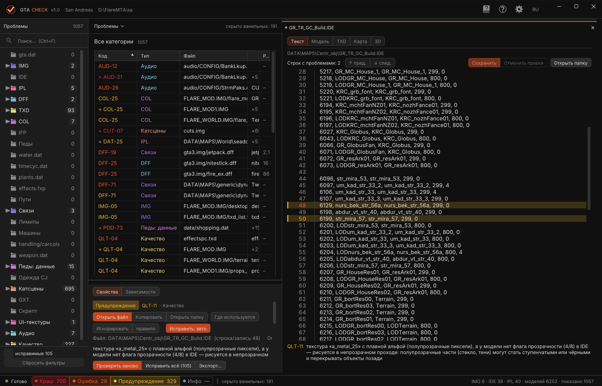
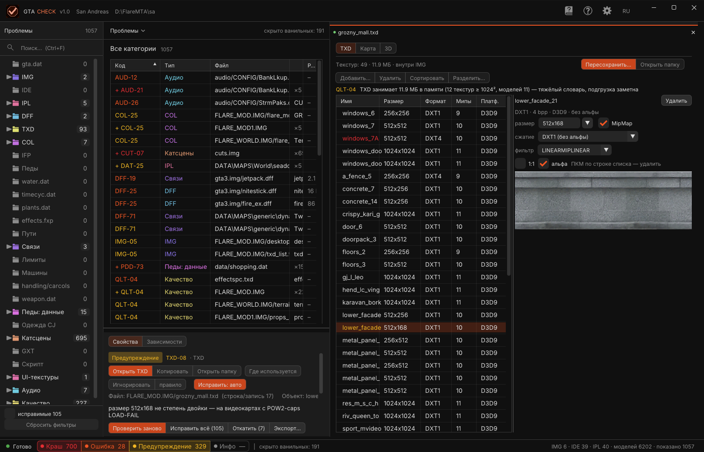
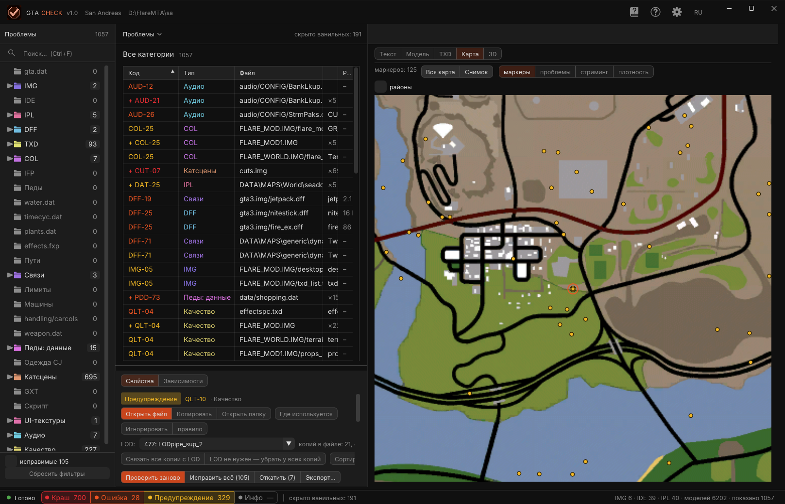
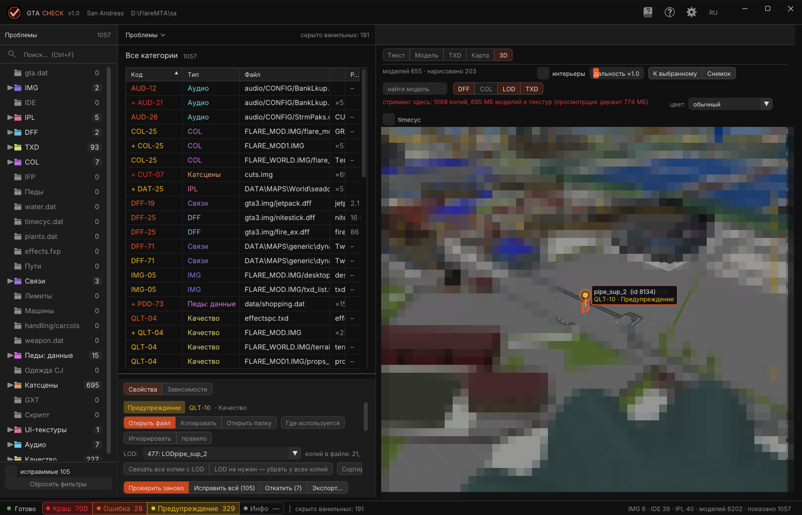
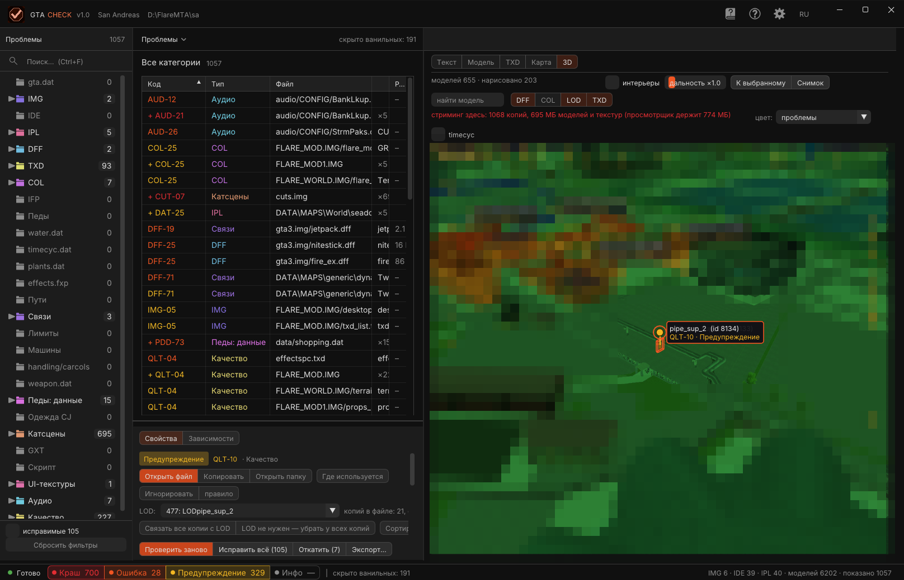
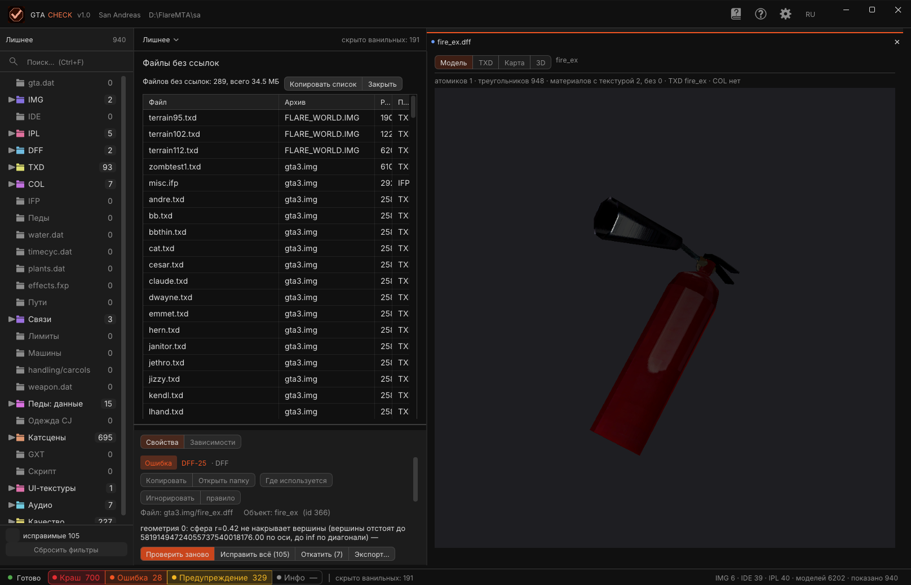
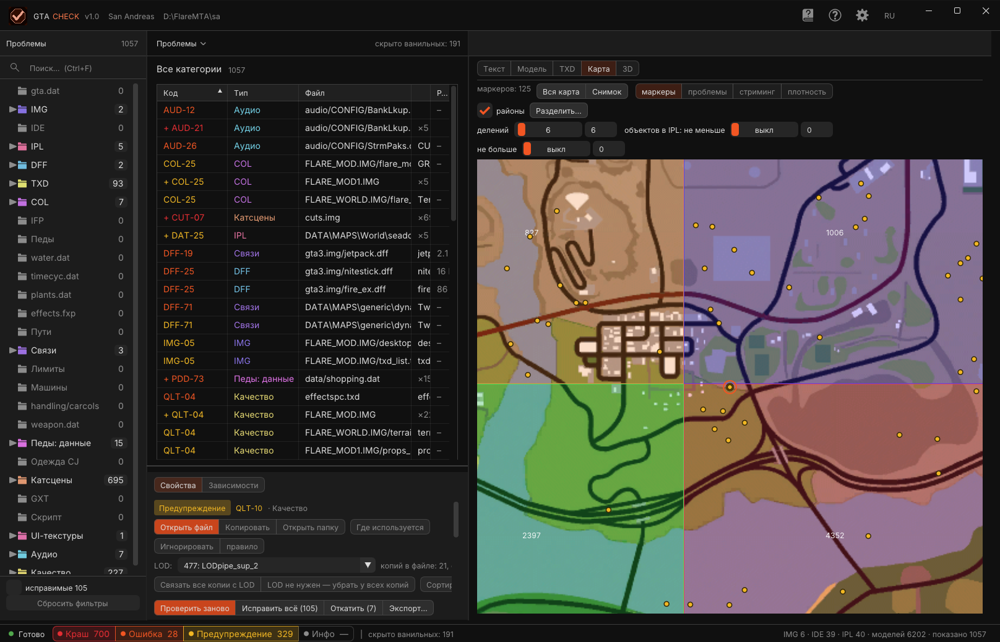

# INU Check (gta_check) — руководство пользователя

Релиз **v1.0** · [English version](MANUAL.md) · [README](README_rus.md) · [Каталог правил](re/GTACHECK_RULES.md)

INU Check — оффлайн-проверщик папки GTA San Andreas / Vice City / III. Он читает папку так же, как это делает
`gta_sa.exe` при старте, и сообщает обо всём, что уронит игру, покажет мусор или просадит производительность —
до запуска. Многое чинит сам, а ещё содержит просмотрщики: редактор текстов, превью моделей, редактор TXD,
2D-карту и 3D-вид мира, собранный из IPL.

Все снимки в руководстве сделаны релизным `gta_check.exe` v1.0.

---

## Содержание

1. [Что это](#1-что-это)
2. [Установка и первый запуск](#2-установка-и-первый-запуск)
3. [Какие файлы создаёт программа](#3-какие-файлы-создаёт-программа)
4. [Окно](#4-окно)
5. [Проверка](#5-проверка)
6. [Таблица проблем](#6-таблица-проблем)
7. [Описание строки](#7-описание-строки)
8. [Правки, бэкап и откат](#8-правки-бэкап-и-откат)
9. [Редактор текста](#9-редактор-текста)
10. [Превью модели](#10-превью-модели)
11. [Редактор TXD](#11-редактор-txd)
12. [Карта](#12-карта)
13. [3D-вид мира](#13-3d-вид-мира)
14. [Лишнее и «Где используется»](#14-лишнее-и-где-используется)
15. [Инструменты: диета TXD и районы](#15-инструменты-диета-txd-и-районы)
16. [Настройки](#16-настройки)
17. [Справочник: коды правил, клавиши и мышь](#17-справочник-коды-правил-клавиши-и-мышь)
18. [Командная строка (CLI)](#18-командная-строка-cli)
19. [Отчёты](#19-отчёты)
20. [Семейства правил](#20-семейства-правил)
21. [Vice City и III](#21-vice-city-и-iii)
22. [Если что-то не так](#22-если-что-то-не-так)
23. [Сборка из исходников](#23-сборка-из-исходников)
24. [Словарь](#24-словарь)

---

## 1. Что это

Игра грузит данные в строгом порядке: `gta.dat` → архивы IMG → IDE/IPL → модели (DFF), текстуры (TXD),
коллизии (COL), анимации (IFP) → handling, оружие, педы, одежда, катсцены, тексты GXT, `main.scm`, звук.
В каждом загрузчике есть места, где входные данные не проверяются; битый файл там роняет игру без сообщения.

INU Check проходит тот же путь с теми же правилами (выведены из реверса загрузчиков 1.0 US, см. `docs/re/`)
и на каждую проблему даёт:

- **уровень** — 💥 Краш · ❌ Ошибка · ⚠️ Предупреждение · ℹ️ Инфо;
- **код правила** (`DFF-19`, `TXD-08`, `QLT-10` …) с пояснением простым языком
  *что это / чем грозит / что делать*;
- **файл** (loose-путь или `архив.img/запись`), **строку** и **объект**;
- **автоматическую правку**, где она безопасна.

Чистая SA 1.0 US даёт **0 крашей**; проблемы, которые есть и у чистой игры, по умолчанию скрыты
(базис ванили). У III и VC свои базисы (поддержка экспериментальная, см. [§21](#21-vice-city-и-iii)).

У программы есть окно (своё, на librw + Dear ImGui) и консольный режим (`--cli`) — та же проверка из скрипта
с отчётами TXT / CSV / JSON / HTML.

## 2. Установка и первый запуск

Скачай `gta_check.exe` из [релиза v1.0](https://github.com/INU-ez/INU_Check-GTA/releases/tag/v1.0).
Установщика и зависимостей нет — Windows x64 с Direct3D 9.

**Окно.** Положи `gta_check.exe` в корень игры (рядом с `gta_sa.exe` и `data\gta.dat`) и запусти. Проверка
начнётся сама. Можно передать папку первым аргументом:

```
gta_check.exe "D:\Grand Theft Auto San Andreas"
```

Папка игры ищется так: аргумент → папка exe → текущая папка. Игра определяется по `data\gta.dat` (SA),
`data\gta_vc.dat` (VC) или `data\gta3.dat` (III).

**CLI.**

```
gta_check.exe --cli "D:\Grand Theft Auto San Andreas" --txt report.txt
```

Полный список ключей — в [§18](#18-командная-строка-cli).

**Что происходит при первом запуске.** Читаются `gta.dat`, каталоги IMG, IDE/IPL, затем каждый DFF / TXD /
COL / IFP из архивов и `modloader\`, потом data-файлы, GXT, скрипт и конфиги звука. На ванильной SA с SSD это
около 10 с; большой мод с несколькими архивами — дольше. Прогресс — в строке состояния и над таблицей; проверка
идёт в фоновом потоке, окно остаётся живым.

## 3. Какие файлы создаёт программа

Программа никогда не трогает файлы игры без явного действия (кнопка «Исправить», «Сохранить», «Пересохранить»,
`--fix-all`).

Рядом с exe:

| Файл | Что |
|---|---|
| `gta_check.ini` | все настройки (язык, схема, раскладка, параметры проверки, размер окна) |
| `gta_check_crash.txt` | отчёт о падении самой программы со стеком |
| `gta_check_d3d.txt` | журнал неудачного сброса устройства Direct3D |

В папке игры — только по твоей просьбе:

| Файл / папка | Что |
|---|---|
| `gta_check_report.txt / .csv / .html` | экспортированные отчёты |
| `gta_check_backup\` | оригиналы всех записанных файлов + `undo.txt` — журнал отката |
| `gta_check_ignore.txt` | список игнора (правится руками, см. [§6](#6-таблица-проблем)) |
| `gta_check_out\` | исправленные файлы, если не влезли на место и modloader нет |
| `modloader\gta_check_fix\` | исправленные файлы, если modloader есть |
| `gta_check_txd_diet\` | результат диеты TXD |
| `gta_check_shot_N.png` | снимки карты / 3D |

С заданной **папкой вывода** (Настройки → Сохранение → «в папку») все записи идут туда, а не в игру: записи IMG —
по имени, loose-файлы — по относительному пути. Готовая папка для `modloader\`.

## 4. Окно



У окна нет системного заголовка: **верхняя полоса** — это заголовок (тянуть — двигать, двойной клик — развернуть,
справа `─ ▢ ✕`). На ней логотип, **GTA CHECK v1.0**, определённая игра и папка игры (двойной клик по пути →
проводник). Справа четыре плитки: **Справочник кодов**, **Справка**, **Настройки** и **язык** (RU → EN → ES,
переключается сразу).

**Колонка (слева).** Заголовок раздела с числом строк (`Проблемы 1057`), поиск (Ctrl+F), затем **дерево
категорий** — все 27, у каждой бейдж-счётчик; у категорий со строками папка окрашена в цвет категории и есть
стрелка, раскрывающая её файлы / архивы. Клик = только эта категория (её папка раскрывается); ещё раз — все;
Ctrl+клик = вкл/выкл одну; клик по файлу под категорией = только его строки (имя попадает в поиск); ПКМ =
перепроверить только эту категорию. Внизу фильтры **исправимые N** (строки с автоправкой) и, после
перепроверки, **новые N**; **Сбросить фильтры** снимает всё, включая поиск.

**Середина.** Крошка **Проблемы ⌄** — её попап переключает **Проблемы / Лишнее** и фильтрует по **IMG / моду**
(все, `gta3.img`, `FLARE_MOD.IMG`, мод modloader …). Справа приглушённо: `скрыто ванильных: 191`,
`игнорируется: N`, `исправлено N · новых N`. Заголовок (`Все категории`, имя категории или `Категории: N из M`)
с числом строк, затем **таблица проблем** ([§6](#6-таблица-проблем)). Под разделителем — **полоса свойств**:
вкладки **Свойства** (описание строки, [§7](#7-описание-строки)) | **Зависимости (N)** (где используется модель
строки) и кнопки **Проверить заново | Исправить всё (N) | Откатить (N) | Экспорт…**.

**Панель справа.** Документ выбранной строки: строка вкладки с именем файла (`● jetpack.dff`, ✕ закрывает),
сегменты **Текст | Модель | TXD | Карта | 3D** (только те, что подходят строке; Карта и 3D есть всегда) и сам
просмотрщик: редактор текста, превью модели, редактор TXD, карта или 3D-мир.

**Строка состояния.** Точка состояния, `Готово` / `Проверка…`, четыре **чипа** уровней — клик показывает / скрывает
уровень (тире = уровень выключен), заметка о ванили, справа сводка папки:
`IMG 6 · IDE 39 · IPL 40 · моделей 6202 · показано 1057`.

**Цветовая схема** (Настройки → цвета) меняет цвета и шрифты, не раскладку: студия (чёрный, оранжевый, по
умолчанию) · игра (палитра меню паузы SA / VC / III, арт загрузочных экранов за окном) · спокойная · Blender ·
панель · неон (ретро-ЭЛТ: моноширинный шрифт, развёртка, свечение, выпуклый экран 3D) · графит · индиго · океан.

## 5. Проверка

### Уровни

| | Значение |
|---|---|
| 💥 **Краш** | игра падает, виснет или пишет LOAD-FAIL на этом файле |
| ❌ **Ошибка** | видимый мусор, пропавшая модель / текстура, порча памяти, которая всплывёт позже |
| ⚠️ **Предупреждение** | подозрительно, игра молча пропускает, может работать по везению |
| ℹ️ **Инфо** | заметка: лимиты, статистика, что программа пропустила (собирается при включённом «инфо») |

### Категории (27)

`gta.dat` · IMG · IDE · IPL · DFF · TXD · COL · IFP · Педы · `water.dat` · `timecyc.dat` · `plants.dat` ·
`effects.fxp` · Пути · Связи (перекрёстные ссылки) · Лимиты · Машины · handling/carcols · weapon.dat ·
Педы: данные · Одежда CJ · Катсцены · GXT · Скрипт · UI-текстуры · Аудио · **Качество**.

Качество (`QLT-nn`) — отдельное семейство: не краши, а качество сборки и производительность — дальность
против радиуса модели, тяжёлые TXD, объекты под водой, перегруженные секторы, дубли расстановки, флаги
прозрачности, мёртвые текстуры, файлы архивов без ссылок, prelit без ночных цветов.

### Базис ванили

Каждая строка хэшируется (`код | файл | объект | сообщение`) и сравнивается с базисом чистой игры (SA 1.0 US,
III, VC). Строки, которые есть и у чистой игры, по умолчанию **скрыты** («скрыть ванильное» в Настройках); их
число — рядом с крошкой. Переключается без перепроверки.

### Что влияет на проверку (Настройки → Проверка)

- **modloader** — папка `modloader\` читается как в игре: loose dff / txd / col / ifp подменяют записи IMG,
  ide / ipl по имени подменяют или добавляются, readme-строки IDE / IPL / IMG.
- **лимит-аджастер** — стоит fastman92 limit adjuster: превышения пулов (TXD 5000, COL 255 / 10150, anims
  2500 …) — заметки, а не краш.
- **инфо** — собирать строки уровня Инфо.
- **только мод** — не проверять содержимое ванильных `gta3.img / gta_int.img / player.img / cutscene.img` (они
  всё равно читаются для перекрёстных ссылок).
- **Что проверять** — DFF, TXD, COL, IFP, данные (семейства можно выключить ради скорости).

Применяются при следующей проверке («Проверить заново»).

### Частичная перепроверка и слежение за папкой

ПКМ по категории → «Перепроверить только …» (категории, зависящие от всего, перепроверяют всё). После проверки
программа следит за папкой игры: записанный, созданный, удалённый или переименованный файл даёт «данные изменились —
проверь заново» в строке состояния. Повторная проверка сравнивается с прошлой: исчезнувшие строки считаются
**исправленными**, появившиеся — **новыми** (фильтр «новые» в колонке).

## 6. Таблица проблем

Колонки: **Код** (цветом уровня: красный краш, оранжевый ошибка, жёлтый предупреждение, серый инфо), **Тип**
(категория своим цветом), **Файл**, **Объект** и **Размер** (записи IMG / DFF). Само сообщение — в описании под
таблицей.

- **Группы.** Одинаковые строки (тот же код и сообщение) сворачиваются в `+ КОД` с `×N` в колонке объекта; клик по
  коду раскрывает.
- **Сортировка.** Клик по заголовку колонки; ещё раз — обратный порядок. По умолчанию — худшие первыми.
- **Фильтры.** Чипы уровней в строке состояния; категории и файлы в колонке; IMG / мод в попапе крошки;
  **исправимые** и **новые** внизу колонки; поиск (Ctrl+F) — по коду, файлу, объекту и сообщению.
- **Выделение.** Клик = выбрать (описание, документ в панели справа, подсветка на карте и в 3D). Ctrl+клик =
  добавить / убрать строку (только того же кода); Shift+клик = диапазон. Множественное выделение работает для
  «Исправить» и «Игнорировать».
- **Двойной клик** открывает файл строки: текст → редактор, TXD → редактор TXD, место (QLT-06) → 3D, иначе папку
  в проводнике.
- **ПКМ** — меню: исправить, открыть файл / TXD, копировать, открыть папку, показать в 3D / на карте, где
  используется, игнорировать; у строк IPL — ещё инструменты LOD из [§7](#7-описание-строки).
- **Игнор.** «Игнорировать» в описании добавляет строку (или, с «правило», всё правило) в
  `gta_check_ignore.txt` в папке игры; при «показывать игнорируемые» они остаются в таблице приглушёнными. Файл
  текстовый, по записи на строку: `rule<TAB>КОД` или `issue<TAB>КОД<TAB>файл<TAB>объект<TAB>сообщение`.

## 7. Описание строки

Вкладка **Свойства** под таблицей показывает для выбранной строки:

1. плашку уровня, **код** (клик → справочник на этом коде), категорию;
2. кнопки: **Открыть файл** (текст) или **Открыть TXD** · **Копировать** (строку текстом) · **Открыть папку** ·
   **Где используется**; **Игнорировать | правило**;
3. **Исправить: авто** и, для имён фреймов DFF, **Исправить: вручную…** — когда правка есть
   ([§8](#8-правки-бэкап-и-откат));
4. `Файл: … (строка/запись N)  Объект: … (id N)`, сообщение и строку detail (числа, смещения, что именно
   прочитано);
5. **Что это / Чем грозит / Что делать** — пояснение правила простым языком.

**У строк IPL** есть инструменты LOD: `LOD: <комбо>` — какая inst-строка того же файла является LOD этой копии
(список = LOD-модели файла по расстоянию; выбор сразу пишется в IPL с бэкапом и откатом);
`копий в файле: N, со связью: M · LOD-модель: …`; **Связать все копии с LOD** (каждой копии модели — LOD-строка
в той же точке, при нехватке добавляется) · **LOD не нужен — убрать у всех копий** (lod := −1) ·
**Сортировать: модель → её LOD** (переставляет весь файл так, чтобы за моделью шла её LOD-строка, индексы
пересчитываются) · **Показать IPL в 3D**.

## 8. Правки, бэкап и откат

### Автоматические правки

| Правка | Правило | Что делает |
|---|---|---|
| Имена фреймов DFF | DFF-30 … | переписывает чанки NodeName (слишком длинные / пустые имена); **вручную…** открывает таблицу «было → станет», где имена вводятся руками |
| TXD степень двойки | TXD-08 | перекодирует текстуры в размеры степени двойки |
| TXD DXT без альфы | TXD-20 | DXT3/DXT5 с альфой везде 255 → DXT1; с настоящей альфой → ставится флаг alpha |
| TXD мёртвые текстуры | QLT-12 | убирает текстуры, которые не использует ни один материал моделей словаря |
| IDE дальность | QLT-01 | дальность := ceil(2 × радиус / 10) × 10 во всех dist-полях строки |
| IDE флаг прозрачности | QLT-11 | флаги |= 4 у моделей, чьи текстуры несут плавную альфу |

**Исправить всё (N)** в полосе свойств (или `--fix-all` в CLI) применяет все автоправки текущей (отфильтрованной)
таблицы после подтверждения. Текстовые правки сохраняют пробелы строки; TXD-правки идут через встроенный кодек и
трогают только те текстуры, которым это нужно. Фильтр **исправимые** показывает ровно те строки, которые тронет
«Исправить всё».

### Куда идёт результат

1. **На место** с копией оригинала в `gta_check_backup\` (по умолчанию). Запись IMG переписывается на месте, если
   влезает в старые секторы; иначе файл идёт в `modloader\gta_check_fix\` (если modloader есть) или `gta_check_out\`.
2. **Папка вывода** (Настройки → Сохранение → «в папку»): игра не трогается; записи IMG пишутся по имени,
   loose-файлы — по относительному пути.

### Откат

Каждая запись добавляет строку в `gta_check_backup\undo.txt`. **Откатить (N)** возвращает последнюю запись
(архив или файл — бит-в-бит как был; правило появится снова после перепроверки). Откат — по одной записи,
новейшая первой. CLI: `--undo`.

## 9. Редактор текста



Открывается для строк IDE / IPL / DAT / CFG / INI в панели справа (сегмент **Текст**). Тулбар: путь файла,
`Строк с проблемами: N` с **↑ пред. / ↓ след.**, **Сохранить**, **Отменить правки**, **Открыть папку**.

- Гуттер с номерами строк; строки, на которые указывает таблица, подсвечены цветом уровня; клик по номеру →
  строка таблицы, которая указывает сюда.
- **F3 / Shift+F3** — следующая / предыдущая строка с проблемой. **Ctrl+S** — сохранить (оригинал в бэкап,
  запись в журнал).
- Ctrl+C / X / V / A как обычно; **Ctrl+колесо** — размер шрифта редактора.
- ПКМ по строке → показать на карте / в 3D / где используется (строки IPL / IDE с моделью); у файлов IPL — ещё
  инструменты LOD.
- Правило выбранной строки повторяется под редактором (`QLT-11 текстура «a_metal_25» …`).
- CRLF определяется при чтении и восстанавливается при записи. `.cut` из `cuts.img` — только просмотр (нумерация
  как в движке — пустые строки пропущены).
- **Отменить правки** сбрасывает сессию; **Esc** закрывает редактор, правки не теряются.
- При сохранении IPL пересчитываются LOD-индексы, если строки добавлялись / удалялись.

## 10. Превью модели

Открывается для строк DFF и объектов с моделью (сегмент **Модель**). Модель читается из IMG (или loose-файла
modloader), её TXD прогоняется через кодек (PAL8 / D3D8 конвертируются, пустые мип-уровни заполняются) и ставится
текущим. Строка сведений: `атомиков 3 · треугольников 15964 · материалов с текстурой 10, без 1 · TXD jetpack ·
COL нет`; текстуры, которых нет в TXD, перечисляются и рисуются на модели **розовым**.

- **ЛКМ / ПКМ — тянуть** — орбита, **СКМ — тянуть** — сдвиг, **колесо** — приблизить, **к модели** — сброс камеры.
- **Выбор полигона** — клик по грани: она подсвечивается, центр орбиты переезжает на неё, в тулбаре — материал /
  текстура; двойной клик приближает.
- Чекбокс **коллизия** — COL модели (сферы / боксы / грани) поверх.
- Педы статичны (skin / hanim не подключены); родительские TXD (`txdp`) не подгружаются.

## 11. Редактор TXD



Открывается для строк TXD (сегмент **TXD**; и из строки модели). Шапка: `Текстур: 49 · 11.9 МБ · внутри IMG`,
**Пересохранить…**, **Открыть папку**; ряд инструментов **Добавить… | Удалить | Сортировать | Разделить…**;
правило выбранной строки.

- **Список**: Имя, Размер, Формат (`DXT1`, `DXT4`, `8888`, `PAL8` …), Мипы, Платф. (`D3D9` / `D3D8`). Текстура
  выбранной строки подсвечена; перетаскивание строки — переставить. ПКМ по строке = удалить.
- **Панель текстуры** (справа): имя, `DXT1 · 4 bpp · D3D9 · без альфы`, **Удалить**; настройки пересохранения
  этой текстуры — **размер** (предел стороны: 512, 256 …), **MipMap**, **сжатие** (DXT1 без альфы, DXT5,
  32 бит …), **фильтр**, флаг **альфа**; **1:1** — превью в натуральную величину. Превью — декодированная текстура.
- **Добавить…** — файл PNG / TGA / BMP становится текстурой; перетащить картинку в окно при открытом TXD — то же
  самое. Не забудь **Пересохранить…**.
- **Пересохранить…** — ремонт кодеком: D3D8 → D3D9, палитры → DXT / 32 бит, AUTOMIPMAP, полная цепочка мипов,
  степень двойки, флаги фильтра и маски, предел стороны. Пишет на место с бэкапом (в `modloader\gta_check_fix\` /
  `gta_check_out\`, если запись не влезает в IMG) или в папку вывода; **В папку…** пишет пересохранённый словарь в
  выбранную папку.
- **Разделить…** — режет словарь на несколько `<имя>_N.txd` по моделям, которые его используют (модели с общей
  текстурой остаются вместе); строки IDE моделей получают новое имя; текстуры, которые никто не использует,
  не переносятся.
- CLI-аналог: `--txd-fix <in> <out> [--ppm]` печатает формат каждой текстуры и что исправлено; нетронутый файл —
  `copy: BIT-EXACT`.

**Перетаскивание.** Любой файл, брошенный в окно, открывается в панели справа: текст → редактор, `.txd` → редактор
TXD, `.dff` → превью модели, `.col` → просмотр архива коллизий, `.img` → список записей. Файл внутри папки игры
можно править с обычным бэкапом и журналом.

## 12. Карта



Сегмент **Карта**. Плитки радара (`radar00..NN.txd`, SA 12×12, III / VC 8×8) декодируются в одну текстуру.
Тулбар: `маркеров: 125`, **Вся карта | Снимок**, слои **маркеры | проблемы | стриминг | плотность**, чекбокс
**районы**.

- **Маркеры** = расставленные в IPL копии моделей, у которых есть строка в текущей отфильтрованной таблице. Строка
  с IPL-файлом и line → та копия; иначе по id → все копии (≤ 2000). Цвет — худший уровень; выбранная строка —
  оранжевое кольцо, карта центрируется на ней. Клик по маркеру → выбрать строку.
- **ЛКМ — тянуть** — сдвиг, **колесо** — масштаб, **Вся карта** — вписать. **Двойной клик по пустому** → камера
  3D переезжает в эту точку (белый ромб = цель камеры 3D).
- **Слои**: проблемы (худший уровень в клетке), стриминг (МБ уникальных DFF + TXD, достающих до клетки) и
  плотность (объектов в клетке) — тепловой картой поверх.
- **Снимок** → `gta_check_shot_N.png` в папке игры.
- **районы** — см. [§15.2](#152-районы).

## 13. 3D-вид мира



Сегмент **3D**: мир из IPL вокруг орбитальной камеры. Модели подгружаются как в игре (ближайшие первыми, бюджет
14 мс на кадр); LOD-модели показаны там, где их дети далеко — то же правило, что у игры (SA: LOD-родитель из
IPL; III / VC: «big building» с дальностью > 300, `FindRelatedModel`, островные LOD).

### Управление

- **ЛКМ / ПКМ — тянуть** — орбита, **СКМ — тянуть** — сдвиг по земле, **колесо** — дистанция.
- **Клик по модели** — выделить: оранжевая рамка + табличка (имя (id), IPL:строка и координаты, DFF архив · КБ ·
  треугольники, TXD архив · КБ · моделей, COL файл · сферы · боксы · грани, LOD, дальность, флаги, код строки).
  Строка в таблице выбирается, если есть. **Клик по пустому** — снять выделение.
- **Маркеры** (строки таблицы): луч + кружок + табличка (`pipe_sup_2 (id 8134)` / `QLT-10 · Предупреждение`) у
  ближайших 40; копии вне кадра прижимаются к краю в своём направлении. Клик = выбрать строку; **двойной клик** =
  подлететь. Смена строки в таблице тоже летит.
- Поле **найти модель**: Enter → подлететь к ближайшей копии. **К выбранному** — к выбранной строке.

### Тулбар

- `моделей 655 · нарисовано 203` — загружено / нарисовано копий.
- **интерьеры** — показывать копии с кодом интерьера (по умолчанию скрыты); **дальность ×** — множитель LOD;
  **К выбранному | Снимок**.
- Слои **DFF | COL | LOD | TXD**. DFF выкл → только LOD-модели (весь мир как издалека); COL → каркас коллизий у
  всех нарисованных копий в 400 ед. (≤ 300); TXD выкл → все модели серые.
- **Строка стриминга** — `стриминг здесь: 1068 копий, 695 МБ моделей и текстур (просмотрщик держит 774 МБ)`: что
  игра должна держать в памяти в точке камеры. Жёлтый от 64 МБ, красный от 128.
- **timecyc** — освещение и небо из `data/timecyc.dat` по часу и погоде, как в игре; при включении: слайдер часа,
  ☀ / ☾ (12:00 / 0:00), комбо погоды, **фильтр** (цветовой фильтр SA) и **туман**.
- **цвет:** — режимы раскраски (легенда складывается / раскладывается в виде):



| Режим | Цвет |
|---|---|
| обычный | текстуры, как в игре |
| проблемы | худшая строка таблицы у модели: красный краш, оранжевый ошибка, жёлтый предупреждение, зелёный — строк нет |
| вес DFF+TXD | зелёный лёгкая · жёлтый ~2 МБ · красный ≥ 4 МБ |
| дальность | зелёный ≤ 100 · жёлтый ~300 · красный > 300 (SA считает такие big building) |
| полигоны | зелёный < 5k · жёлтый ~10k · красный ≥ 20k треугольников |
| IPL | свой цвет каждому IPL-файлу, легенда с числом объектов и МБ |
| архив | свой цвет каждому IMG (loose-файлы modloader отдельно) |
| ваниль / мод | серый — ванильный архив, оранжевый — мод |
| LOD | синий — LOD-модель, зелёный — есть LOD-пара, тускло-зелёный — без LOD при дальности < 300, оранжевый — без LOD при ≥ 300 |
| коллизия | красный — нет COL, жёлтый — COL пустой, зелёный — есть |
| плотность | объектов в клетке модели 50×50 м: зелёный мало · жёлтый ~80 · красный ≥ 160 |
| флаги IPL | синий под водой · фиолетовый туннель · серый неважный стриминг · жёлтый tobj |
| прозрачность | красный — модель с флагами альфы (4 / 8), зелёный — без |
| TXD в стриминге | красный — TXD у одной модели · жёлтый 2–4 · зелёный ≥ 5 |
| районы | каждая модель в цвете своего района, границы — полупрозрачные стенки; чекбокс **вся карта** грузит все копии на любой дистанции |

«Текстуры в цветных режимах 3D» (Настройки) умножает цвет на текстуру; районы всегда сплошные.

## 14. Лишнее и «Где используется»



**Лишнее** (крошка → Лишнее): файлы архивов, на которые никто не ссылается — DFF не в IDE, TXD без моделей (не
системный и не paint job `<car>N.txd`), COL без совпавших моделей, IFP не в `animgrp.dat` / IDE. Имена из
`main.scm` / `script.img` считаются используемыми (special-модели). Колонки Файл, Архив, Размер, Почему лишний;
итог (`289 файлов, 34.5 МБ`), **Копировать список | Закрыть**. То же, что правило QLT-09.

**Где используется** (кнопка в описании, ПКМ в редакторе, вкладка **Зависимости**): текстовый поиск имени
модели / текстуры по всем IDE, IPL, `data\*`, катсценам и архивам; каждое попадание — файл + строка, клик
открывает.

## 15. Инструменты: диета TXD и районы

### 15.1 Диета TXD

Настройки → Сохранение → **Диета TXD…**: все TXD (или только размещённых моделей) прогоняются через кодек с
пределом стороны (половинить до ≤ 256 / 512 / 1024) и DXT — в `<outdir>\txd_diet`, `modloader\gta_check_txd_diet`
или `gta_check_txd_diet`. Без журнала — это новая папка, которую кладут в modloader. Прямой ответ на перегруженный
стриминг (QLT-04 / строка стриминга в 3D).

### 15.2 Районы



Карта → чекбокс **районы** → карта делится сеткой `делений × делений` (SA ±3000). В клетке — число расставленных
объектов; LOD и его дети всегда в одной клетке. **объектов в IPL: не меньше / не больше**: клетки меньше минимума
объединяются с соседом; больше максимума — красная рамка.

**Разделить…** пишет для каждого района `d<x>_<y>`:

- **IPL** — `data\maps\district\d<x>_<y>.ipl` с inst-строками клетки (lod-индексы пересчитаны; остальные секции
  остаются в исходных файлах; интерьеры не трогаются; текстовые IPL, на которые ссылаются стрим-IPL, пропускаются —
  их ординалы сдвигать нельзя);
- **IDE** — objs / tobj / anim моделей, все копии которых в клетке → `d<x>_<y>.ide`;
- **COL** — записи COL этих моделей → `d<x>_<y>.col`, из исходных `.col` убираются;
- **LOD TXD** — текстуры LOD-моделей → `lod_d<x>_<y>.txd` (или один `lod_all.txd` при «one»), token txd в IDE
  патчится;
- в `gta.dat` добавляются новые строки IDE / IPL (лимит 256 слотов CIplStore).

Текстовые правки — на место с бэкапом и журналом; новые `.col` / `.txd` — в папку вывода / `modloader\gta_check_fix` /
`gta_check_out`. В 3D режим «районы» показывает план до записи.
CLI: `--district N [--district-min M] [--district-what ipl,ide,col,txd,one] [--district-log f]`.
Для III / VC делятся только IPL и IDE.

## 16. Настройки

Плитка с шестерёнкой в верхней полосе. Применяются сразу, если не сказано иное.

**Что проверять** (при следующей проверке): DFF · TXD · COL · IFP · данные · инфо.

**Сборка** (при следующей проверке): modloader · лимит-аджастер · только мод.

**Сохранение**: на место (копия в `gta_check_backup`) | в папку: … (Выбрать…) · **Диета TXD…**.

**Показ**: скрыть ванильное · показывать игнорируемые · подсказки при наведении (по умолчанию выключены — полный
список сочетаний в справочнике) · текстуры в цветных режимах 3D · фон из загрузочных экранов игры (схема «игра»).

**Цвета**: схема — студия (чёрный, оранжевый) · игра (палитра меню паузы SA / VC / III) · спокойная (нейтральные
серые) · Blender (серые панели, синий) · панель (тёмно-синий) · неон (ретро CRT, моноширинный) · графит (зелёный) ·
индиго (фиолетовый) · океан (бирюзовый). Для неона: **эффект ЭЛТ** (развёртка, выпуклый экран 3D, свечение) и
**цвет** люминофора (янтарный / зелёный / красный / голубой / белый). **Шрифт** (Inter, Roboto, IBM Plex Sans,
Manrope, Rubik, Exo 2, Play, JetBrains Mono, JetBrains Mono Bold, Russo One) и **масштаб** 100 / 125 / 150 %.

Всё живёт в `gta_check.ini` рядом с exe.

## 17. Справочник: коды правил, клавиши и мышь

Плитка с книгой в верхней полосе. Две вкладки:

- **Коды правил** — каждый код с *что это / чем грозит / что делать*. Открытый со строки — подсвечивает её код
  (`COL-23a` находит `COL-23`). Полный каталог с адресами функций — [docs/re/GTACHECK_RULES.md](re/GTACHECK_RULES.md).
- **Клавиши и мышь** — таблица ниже.

| Где | Клавиши / мышь | Что |
|---|---|---|
| Везде | Ctrl+F | поиск по таблице |
| Везде | Esc | закрыть окно, редактор или попап |
| Везде | двойной клик по верхней полосе | развернуть / восстановить |
| Везде | двойной клик по пути папки | открыть папку игры в проводнике |
| Таблица | клик | выбрать строку |
| Таблица | двойной клик | открыть файл строки (текст → редактор, TXD → редактор TXD, место → 3D, иначе папка) |
| Таблица | Ctrl+клик / Shift+клик | добавить в выделение / диапазон (тот же код) |
| Таблица | ПКМ | меню строки |
| Таблица | клик по заголовку | сортировка (ещё раз — обратно) |
| Таблица | клик по `+ КОД` | развернуть / свернуть группу |
| Категории | клик / Ctrl+клик / стрелка / ПКМ | только эта / вкл-выкл / раскрыть файлы / перепроверить |
| Строка состояния | клик по уровню | показать / скрыть краши, ошибки, предупреждения, инфо |
| Редактор | Ctrl+S · F3 / Shift+F3 · Ctrl+колесо · Ctrl+C/X/V/A | сохранить · следующая / предыдущая проблема · размер шрифта · буфер |
| Редактор | ПКМ · клик по номеру строки | карта / 3D / где используется · выбрать строку, указывающую сюда |
| 3D | ЛКМ / ПКМ — тянуть · СКМ — тянуть · колесо | орбита · сдвиг · дистанция |
| 3D | клик по модели / маркеру · двойной клик · клик по пустому · Enter в «найти» | выбрать · подлететь · снять выделение · к модели |
| Карта | ЛКМ — тянуть · колесо · клик по маркеру · двойной клик по пустому | сдвиг · масштаб · выбрать строку · перенести камеру 3D |
| Превью модели / TXD | ЛКМ — тянуть · колесо | повернуть · приблизить |
| Окно TXD | тянуть текстуру | переставить |

## 18. Командная строка (CLI)

```
gta_check.exe --cli <папка игры> [ключи]

Отчёты
  --txt f | --csv f | --json f | --html f   записать отчёт (HTML — с пояснениями правил)
  --lang ru|en|es                           язык сообщений
  --info                                    включить уровень Инфо
  --show-vanilla                            показывать и то, что есть у чистой игры

Проверка
  --no-modloader                            не учитывать modloader\
  --limit-adjuster                          превышения пулов — заметки, не краш
  --mod-only                                не проверять содержимое ванильных IMG
  --no-dff --no-txd --no-col --no-ifp --no-data   выключить семейства

Правки
  --fix-all                                 применить все автоправки
  --out <папка>                             все записи — в эту папку, а не в игру
  --undo                                    вернуть последнюю запись из gta_check_backup\undo.txt

Районы (после проверки)
  --district N [--district-min M] [--district-what ipl,ide,col,txd,one] [--district-log f]

Разработка
  --baseline-dump f                         дамп для базиса ванили (make_baseline.py)
  --lang-missing f                          непереведённые строки

Отдельно
gta_check.exe --fix-dff <in.dff> <out.dff>            исправить имена фреймов одного файла
gta_check.exe --txd-fix <in.txd> <out.txd> [--ppm]    пересохранить TXD кодеком (печатает каждую текстуру)
```

**Код выхода**: `0` — крашей нет, `1` — краши найдены (скрытые ванильные не считаются), `2` — плохие аргументы или
нечитаемый файл.

Вывод в консоль: exe — оконная программа; запущенная из консоли, она подключается к ней. Из PowerShell
`Start-Process -Wait -NoNewWindow` или редирект этого не ловят — результат писать в `--txt` / `--html`. Пути с
пробелами — в кавычках.

Примеры:

```
:: отчёт по сборке, с инфо
gta_check.exe --cli "D:\GTA SA" --html report.html --info

:: исправить всё в папку modloader
gta_check.exe --cli "D:\GTA SA" --fix-all --out "D:\GTA SA\modloader\fixes"

:: разделить карту на 6×6 районов, только IPL и IDE
gta_check.exe --cli "D:\GTA SA" --district 6 --district-what ipl,ide --district-log split.txt
```

## 19. Отчёты

- **TXT** — шапка с версией, игрой, папкой и числами, затем секции по уровням: `[КОД] файл:строка (объект)`,
  сообщение, `→ detail`.
- **CSV** — по строке на проблему: `severity;category;code;file;line;id;object;message;detail`.
- **JSON** (только CLI) — те же поля объектами + `vanilla`.
- **HTML** — одна страница: таблица по уровням, каждый код — ссылка на раздел «Справочник кодов» с пояснением.

Экспорт из окна: **Экспорт…** в полосе свойств → **Отчёт TXT | Таблица CSV | Отчёт HTML | Открыть папку игры**
(`gta_check_report.*` в папке игры).

## 20. Семейства правил

| Семейство | Файлы | Примеры |
|---|---|---|
| `DAT` | `gta.dat` / `default.dat`, `water.dat`, `timecyc.dat`, `plants.dat`, `object.dat`, `effects.fxp`, `nodes*.dat`, `procobj.dat` | нет файла, битая строка, LOD-связь за пределами (DAT-22), позиция вне ±3000 (DAT-25) |
| `IDE` `IPL` `IMG` | все секции IDE, текстовые + бинарные стрим-IPL, каталоги IMG | дубль id, плохие флаги, чужое расширение в IMG (IMG-05) |
| `DFF` | структура RW, BinMesh, 2DFX, ночные цвета, UV-анимация, breakable, скин педа, коллизия машины | DFF-02 нет расширения, DFF-19 нет текстуры в TXD, DFF-25 сфера не накрывает вершины, DFF-29/30 имена фреймов |
| `TXD` `UI` | растры, форматы, цепочки мипов, D3D8 / PAL8, UI-TXD, плитки радара | TXD-08 не степень двойки, TXD-12 плохой фильтр / адресация, TXD-20 DXT без альфы |
| `COL` | COL 1–4 — группы граней, тени, границы, счётчики | COL-02, COL-25 имя не совпадает с моделью, COL-27 |
| `IFP` | ANPK / ANP2 / ANP3, времена, квантование, `animgrp.dat` | IFP-07 убывающие времена |
| `VEH` `HND` | фреймы / extras / dummy против `ms_vehicleDescs`, `handling.cfg`, `carcols`, `carmods`, `cargrp`, `vehicles.ide`, remap-TXD, audio id | нет строки handling, dummy вне диапазона |
| `WPN` `PDD` `PED` | `weapon.dat`, `ped.dat`, `pedstats`, `pedgrp`, `popcycle`, `peds.ide`, `decision\*`, `surface*.dat`, `shopping`, статистика; скины педов | число костей, слот оружия, PDD-73 shopping.dat |
| `CLO` | `player.img`, `clothes.dat` | нет normal / fat / ripped клампа |
| `CUT` | `anim\cuts.img` (.cut / .ifp / .dat), `cutscene.img` | CUT-07 лимит special-моделей |
| `GXT` `SCM` | `text\*.gxt`, `main.scm` / `script.img`, `stream.ini`, `fonts.dat` | GXT-04 размер TABL |
| `AUD` | `audio\CONFIG\*.dat`, банки SFX, стрим-паки, `TrakLkup` | AUD-12 нет банка, AUD-21 |
| Связи | модель ↔ DFF ↔ TXD (+ txdp / vehicle) ↔ COL ↔ IPL, текстуры материалов ↔ TXD, лимиты пулов | DFF-71 модель без IPL, COL-27, IDE-03, TXD-28 |
| `QLT` | качество сборки | 01 дальность < радиуса, 02 мелочь с дальностью > 300, 03 procobj, 04 тяжёлый TXD, 05 под водой, 06 перегруженный сектор, 07 имя GXT, 08 файл в нескольких модах, 09 лишние файлы, 10 дубль расстановки, 11 флаг альфы, 12 мёртвые текстуры, 13 текстура в ≥ 5 TXD, 14 наложение / дыры IMG, 16 prelit без ночных цветов |

## 21. Vice City и III

Определяются по `gta_vc.dat` / `gta3.dat`. По исходникам re3 / reVC:

- свои базисы ванили: чистые III и VC дают **0 крашей**;
- форматы: IMG VER1 с `.dir`, COLL / COL2, ANPK, DFF RW 3.1 / 3.2 (расширение клампа за чанком), TXD D3D8 /
  PAL8, `txd.img` (III);
- лимиты движка (пулы, зоны, 2dfx, IFP, timecyc), `handling.cfg` с именами, вшитыми в exe, педы без скина,
  `waterpro.dat`; поле `interior` в IPL VC = area (13 = везде);
- 3D: видимость LOD по правилам игры (`SetupBigBuilding`, `FindRelatedModel`), островные LOD, свет (ambient +
  prelit ×1) и декали как в игре, `generic.txd` из TEXDICTION-файлов.

Не откалибровано: `weapon.dat`, GXT (в III нет TABL), `carcols`, `object.dat`, cull-зоны, `particle.cfg` — эти
семейства для III / VC пропускаются. Районы: только IPL и IDE. Ложные срабатывания возможны — сообщай с кодом
правила.

## 22. Если что-то не так

- **Программа упала.** `gta_check_crash.txt` рядом с exe: код исключения, адрес и стек с именами модулей — приложи
  к issue. Если файла нет — журнал Windows «Приложение» (событие 1000).
- **Чёрное / белое окно, модели пропали после ресайза.** `gta_check_d3d.txt` пишет неудачный сброс устройства —
  приложи к issue.
- **На текстурах буквы UI / модели чёрные вдали.** Просмотрщик это лечит (непригодные текстуры сбрасываются, пустые
  хвосты мипов заполняются); если осталось — TXD битый, смотри строки TXD.
- **«Папка игры не найдена».** Exe должен лежать рядом с `gta_sa.exe` (`data\gta.dat`), или передай папку аргументом.
- **Нет вывода в консоль в CLI.** Пиши в файл (`--txt`, `--html`, `--district-log`).
- **Ложное срабатывание на чистой игре.** Сообщи код правила и файл — нужно поправить базис или правило.

Известные ограничения: педы в превью статичны; родительские TXD в превью не грузятся; список игнора в CLI не
применяется; в TXT-отчёте нет пояснений правил; районы для III / VC — только IPL и IDE; текстовые IPL не
переводятся в бинарные стрим-IPL.

## 23. Сборка из исходников

```
build.bat            → bin\win-amd64-d3d9\Release\gta_check.exe
build.bat debug      → отладочная сборка (/Zi /Od)
```

Visual Studio 2022+, MSVC x64, C++17. Путь к VS — первая строка `build.bat`. librw, Dear ImGui 1.92.2b, nanosvg и
шрифты лежат в репозитории; `rw.lib` собран. Иконка и версия: `src/gtacheck.rc` (`src/gen_icon.py` делает иконку
из `src/icon.png`).

`librw\` — форк с локальными правками (защита от NULL в `CreateTexture`, проверка `Reset()`, исправленный двойной free
в `Clump::streamRead`, модификаторы клавиш в `imgui_impl_rw.cpp`, окно без системного заголовка и кадры во время
перетаскивания). После правки librw пересобрать `rw.lib` из VS Developer Shell:

```
msbuild librw\build\librw.vcxproj "/p:Configuration=Release win-amd64-d3d9" /p:Platform=x64 /m:1
```

Новое правило: сообщение пишется по-русски через `Context::add(...)` в нужном `check_*.cpp` (русский текст — ключ
базиса и перевода); строка пояснения в `rule_help.cpp`; переводы через `python make_lang.py sync` → перевести
`lang_keys.txt` → `merge <файл> en|es` → `build` (проверка `--cli <папка> --lang en --info --lang-missing f` → `0`);
если правило срабатывает на чистой игре — регенерировать базис: `--cli <ваниль> --no-modloader --info
--baseline-dump dump.txt` → `python make_baseline.py dump.txt [iii|vc]`. Версия: `GC_VERSION` в `gtacheck.h`,
`src/gtacheck.rc`, бейджи README.

## 24. Словарь

- **IMG** — архив с моделями / текстурами / коллизиями (`gta3.img`); VER2 в SA, `.img` + `.dir` в III / VC.
- **IDE** — определения объектов (id, модель, TXD, дальность, флаги). **IPL** — расстановка (копии) этих объектов;
  текстовая или бинарная стримовая (`.ipl` внутри `gta3.img`).
- **DFF / TXD / COL / IFP** — модель / словарь текстур / коллизия / анимация RenderWare.
- **LOD** — низкодетальная модель, видимая издалека; в SA связана через IPL (поле `lod`), в III / VC — по имени и
  дальности.
- **prelit** — цвета вершин в DFF (день); **ночные цвета вершин** — второй набор для ночи.
- **2dfx** — эффекты на модели: фонари, частицы, маркеры входа.
- **modloader** — загрузчик модов; файлы в `modloader\<мод>\` подменяют файлы игры.
- **ваниль** — чистая, немодифицированная игра.
- **big building** — в III / VC / SA модель с дальностью > 300; движок считает её LOD.
