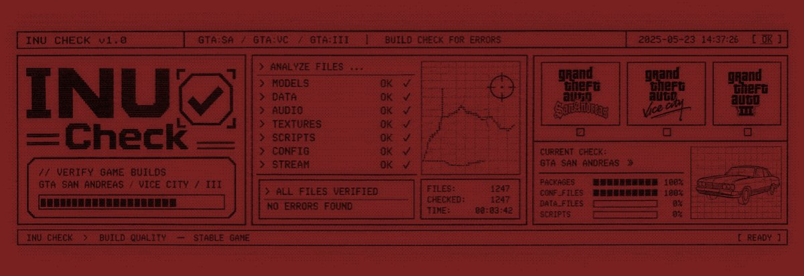
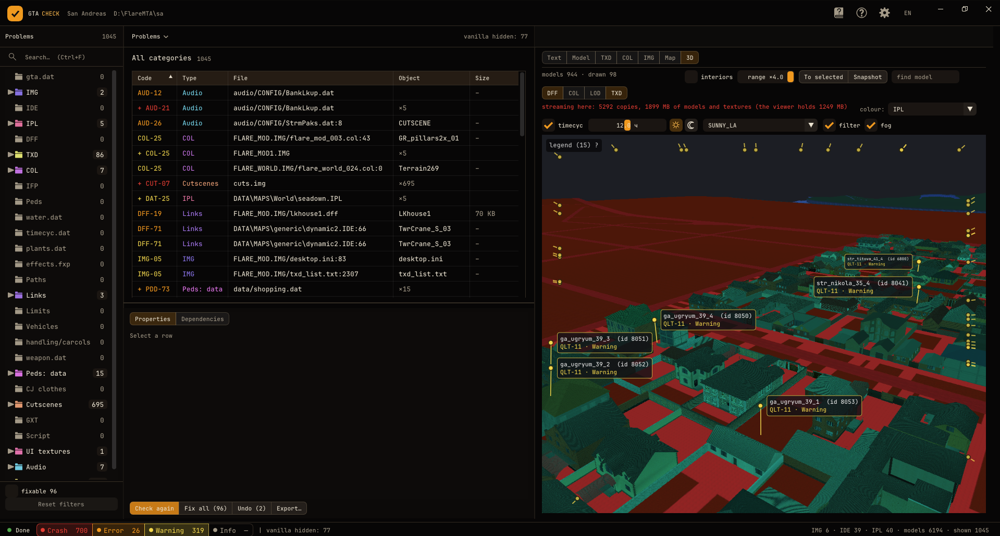

<div align="center">

<!--  -->

# INU_Check (GTA SA)

**Оффлайн-проверка установки GTA San Andreas — находит то, что уронит игру, ещё до запуска.**

<p>
  
  
  
  
</p>

**[🇬🇧 English version](../README.md)** · **[📖 Каталог правил](re/GTACHECK_RULES.md)**

</div>

---

## Главное

<table>
<tr>
<td width="50%" valign="top">

- **Проверяет как игра** — проходит папку в том же порядке, что `gta_sa.exe` при старте: gta.dat, IMG, IDE/IPL, DFF/TXD/COL/IFP, handling, оружие, педы, одежда, катсцены, GXT, main.scm, аудио.
- **~450 кодов правил** из реверса загрузчиков 1.0 US — у каждого кода есть функция и конкретная непроверенная операция, которая ломает игру.
- **Ноль шума на ванили** — чистая SA 1.0 US даёт 0 крашей; всё, что есть и у ванили, по умолчанию скрыто.
- **Пояснения простым языком** — «что это / чем грозит / что делать» под каждой строкой, плюс справочник кодов.
- **Умеет чинить** — имена фреймов DFF, пересохранение TXD (D3D8→D3D9, палитры, мипы, pow2), правка текста; с бэкапом, **откатом** или в отдельную папку для modloader.
- **Встроенные просмотрщики** — текстовый редактор на нужной строке, 3D-превью модели с коллизией, просмотр TXD (в том числе PAL8/D3D8), 2D-карта с тепловыми слоями, 3D-карта мира из IPL.
- **Понимает modloader** — loose-файлы, IDE/IPL по имени, строки из readme модов; fastman92 limit adjuster распознаётся.
- **Правила качества** (`QLT`) — дальность против радиуса, тяжёлые TXD, объекты под водой, перегруженные сектора, лишние файлы в архивах.
- **Окно + консоль** — та же проверка из скрипта с отчётом TXT / CSV / JSON / HTML и кодом возврата.
- Интерфейс **RU / EN / ES**.

</td>
<td width="50%" valign="top">

<!--  -->

</td>
</tr>
</table>

→ **[Что нового](../../../releases/latest)** · [История версий](../../../releases)

## Что проверяется

| Область | Файлы | Семейства |
|---|---|:---:|
| **Загрузка данных** | `gta.dat` / `default.dat`, каталоги IMG (VER2, III/VC `.dir`), IDE (все секции), IPL (текст + streamed bnry), LOD-связи, `water.dat`, `timecyc.dat`, `plants.dat`, `object.dat`, `effects.fxp`, `nodes*.dat`, `procobj.dat` | `DAT` `IDE` `IPL` `IMG` |
| **Модели** | DFF — структура RW, BinMesh, 2DFX, night colours, UV-анимация, breakable, скин педов, встроенная коллизия машин | `DFF` |
| **Текстуры** | TXD — растры, форматы, цепочки мипов, D3D8 / PAL8, UI-TXD, тайлы радара | `TXD` `UI` |
| **Коллизия** | COL 1–4 — face-группы, тени, границы, число сфер/боксов | `COL` |
| **Анимация** | IFP — ANPK / ANP2 / ANP3, времена, квантование, `animgrp.dat` | `IFP` |
| **Машины** | фреймы / extras / dummy против `ms_vehicleDescs`, `handling.cfg`, `carcols.dat`, `carmods.dat`, `cargrp.dat`, `vehicles.ide`, `vehicle.txd`, remap-TXD, audio-id | `VEH` `HND` |
| **Оружие и педы** | `weapon.dat`, `ped.dat`, `pedstats.dat`, `pedgrp.dat`, `popcycle.dat`, `peds.ide`, `decision\*`, `surface*.dat`, `shopping.dat`, `statdisp.dat`, `ar_stats.dat` | `WPN` `PDD` |
| **Одежда CJ** | `player.img`, `clothes.dat`, клампы normal / fat / ripped, базовые TXD | `CLO` |
| **Катсцены** | `anim\cuts.img` (.cut / .ifp / .dat), special-модели `cutscene.img` | `CUT` |
| **Текст и скрипт** | `text\*.gxt`, `main.scm` / `script.img`, `stream.ini`, `fonts.dat` | `GXT` `SCM` |
| **Аудио** | `audio\CONFIG\*.dat`, SFX-банки, стрим-паки, `TrakLkup`, аудио машин | `AUD` |
| **Перекрёстные ссылки** | модель ↔ DFF ↔ TXD (+ txdp / vehicle) ↔ COL ↔ IPL, текстуры материалов ↔ TXD, лимиты пулов | — |
| **Качество сборки** | дальность прорисовки, вес TXD, объекты под водой, плотность секторов, gxt-имена, дубли в модах, лишние файлы | `QLT` |

Четыре уровня: **Краш** (падение / зависание / LOAD-FAIL) · **Ошибка** (видимый мусор, порча памяти) ·
**Предупреждение** (подозрительно, игра молча игнорирует) · **Инфо**. Полный каталог с адресами функций —
в **[каталоге правил](re/GTACHECK_RULES.md)**.

## Установка

Скачай `gtacheck.exe` из [последнего релиза](../../../releases/latest). Установка и зависимости не нужны.

**Окно:** положи `gtacheck.exe` в корень игры (рядом с `gta_sa.exe` / `data\gta.dat`) и запусти —
проверка начнётся сама. Или передай папку: `gtacheck.exe "D:\Grand Theft Auto San Andreas"`.

**Консоль:**

```
gtacheck.exe --cli "D:\Grand Theft Auto San Andreas" --txt report.txt
```

> Программа не трогает файлы игры без твоего действия. Рядом с exe создаётся `gtacheck.ini`, а в папке
> игры — только по запросу: `gtacheck_report.*` (экспорт), `gtacheck_backup\` (оригиналы + журнал отката)
> и `gtacheck_ignore.txt` (список «игнорировать»).

<details>
<summary>Все ключи командной строки</summary>

```
gtacheck.exe --cli <папка игры> [ключи]

  --txt f | --csv f | --json f | --html f   отчёт в файл (HTML — с пояснениями правил)
  --lang ru|en|es                           язык сообщений
  --info                                    включить уровень «Инфо»
  --show-vanilla                            показывать и то, что есть у чистой SA 1.0 US
  --no-modloader                            не учитывать modloader\
  --limit-adjuster                          превышения пулов считать заметками
  --mod-only                                не проверять содержимое ванильных IMG
  --no-dff --no-txd --no-col --no-ifp --no-data   отключить семейства проверок
  --fix-all [--out <папка>]                 применить авто-исправления (в игру с бэкапом или в папку)
  --undo                                    откатить последнее исправление из журнала

gtacheck.exe --fix-dff <in.dff> <out.dff>            починить имена фреймов одного файла
gtacheck.exe --txd-fix <in.txd> <out.txd> [--ppm]    пересохранить TXD (печатает формат каждой текстуры)
```

Код возврата: `0` — крашей нет, `1` — есть краши (без скрытых ванильных), `2` — неверные аргументы или
файл не читается.

</details>

## Совместимость

| | |
|---|---|
| **Игра** | GTA San Andreas 1.0 US (откалибровано); Vice City и III — экспериментально |
| **Моды** | modloader, fastman92 limit adjuster, папки MTA:SA |
| **ОС** | Windows x64 (Direct3D 9) |
| **Сборка** | Visual Studio 2022+, MSVC, C++17 — других зависимостей нет |

<details>
<summary>Поддержка III / VC / SA — подробности</summary>

Игра определяется по `data\gta.dat` / `gta_vc.dat` / `gta3.dat`; палитра окна следует ей (SA — тёплый
чёрный + оранжевый, VC — ночной фиолетовый + неон, III — синий Либерти-Сити + золото), карта берёт нужную
сетку тайлов радара (12×12 или 8×8).

III и VC проходят те же правила: структуры файлов (VER1 `.dir` IMG, COLL/COL2, ANPK, DFF RW 3.1/3.2,
D3D8 / PAL8 TXD) разбираются верно, но многие пороги SA к ним пока не применимы — ждите ложных
срабатываний, пока не сделана калибровка под III/VC.

</details>

<details>
<summary>Сборка из исходников</summary>

```
build.bat            → bin\win-amd64-d3d9\Release\gtacheck.exe
build.bat debug      → отладочная сборка (/Zi /Od)
```

Путь к Visual Studio задан в первой строке `build.bat` (`set VS=…`) — поправь под свою установку.
librw, Dear ImGui 1.92.2b и шрифты лежат в репозитории, `rw.lib` уже собран.

`librw\` — форк [librw](https://github.com/aap/librw) (ветка southland) **с локальными правками**, которых
нет в апстриме: защита от NULL из `CreateTexture`, проверка результата `Reset()` устройства, исправленный
двойной free в `Clump::streamRead` при обрезанном DFF, модификаторы клавиш в `imgui_impl_rw.cpp`. После
изменения исходников librw пересобери `rw.lib` из VS Developer Shell:

```
msbuild librw\build\librw.vcxproj "/p:Configuration=Release win-amd64-d3d9" /p:Platform=x64 /m:1
```

</details>

<details>
<summary>Структура репозитория и добавление правила</summary>

```
src/              исходники gtacheck (C++17)
  main.cpp          окно, панели, карта, 3D, CLI, crash-reporter
  runner.cpp        порядок фаз проверки, перекрёстные ссылки
  gamedata.cpp      gta.dat, IMG, IDE/IPL, правила DAT-*
  check_*.cpp       правила по семействам (txd, dff, veh, col, ifp, handling, weapon, ped,
                    clothes, cuts, text, audio, misc, quality)
  txd_edit.cpp      собственный кодек TXD (разбор, декод, ремонт, DXT-энкодер, запись бит-в-бит)
  fix.cpp           исправления DFF, запись с бэкапом, папка вывода, журнал отката
  rule_help.cpp     пояснения к кодам правил простым языком
  lang.cpp/.tsv     переводы RU/EN/ES (make_lang.py sync|merge|build)
  vanilla_sa.h      базис ванильной SA 1.0 US (make_baseline.py)
  tables_*.h        таблицы, снятые с exe (педы, аудио)
librw/            форк librw + skeleton + Dear ImGui (с правками)
docs/re/          результаты реверса загрузчиков gta_sa.exe 1.0 US и каталог правил
build.bat         сборка
```

1. Сообщение пишется **по-русски** через `Context::add(...)` в нужном `check_*.cpp`; по русскому тексту
   считается ключ ванильного базиса и ищется перевод.
2. Пояснение — строка `{код, что это, чем грозит, что делать}` в `rule_help.cpp`.
3. Переводы: `python make_lang.py sync` → перевести `lang_keys.txt` → `python make_lang.py merge <файл> en|es`
   → `python make_lang.py build`. Проверка: `--cli <папка> --lang en --info --lang-missing f` → `0`.
4. Если правило срабатывает на чистой SA, перегенерируй базис:
   `--cli <ваниль> --no-modloader --info --baseline-dump dump.txt` → `python make_baseline.py dump.txt` → сборка.

</details>

## Известные ограничения

- 3D-превью педов статично (skin / hanim не подключены); родительские TXD (`txdp`) в превью не подгружаются.
- При падении программы рядом появляется `gtacheck_crash.txt` со стеком — приложи его к issue.

## Ссылки

- 📖 [Каталог правил](re/GTACHECK_RULES.md) · [Заметки реверса](re/)
- 🧰 [INU_Tools](https://github.com/INU-ez/INU_Tools-GTA-Blender) — аддон Blender для моддинга GTA SA от того же автора

## Благодарности

- **[librw](https://github.com/aap/librw)** (aap, MIT) — реимплементация RenderWare: чтение DFF/TXD, рендер D3D9, каркас окна.
- **[Dear ImGui](https://github.com/ocornut/imgui)** (MIT) и **[ImGuizmo](https://github.com/CedricGuillemet/ImGuizmo)** (MIT) — интерфейс.
- **[euryopa](https://github.com/aap/euryopa)** (aap) — ориентир для расстановки IPL и LOD в 3D-виде.
- Шрифты **Russo One**, **Inter**, **JetBrains Mono** — SIL Open Font License 1.1.

**Автор:** INU (Discord `1.n.u` · [сервер](https://discord.gg/sqtGAVTGdy))

**Лицензия:** см. [LICENSE](../LICENSE)
